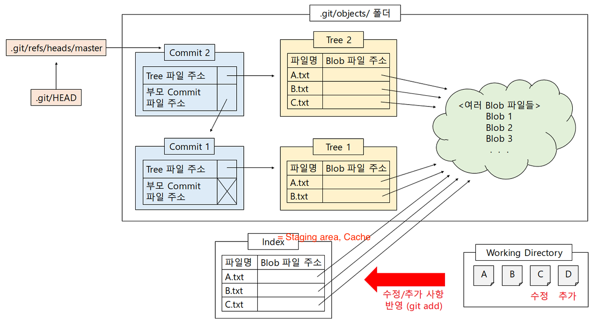

출처 없는 지식이나 기반이 약한 지식을 싫어하는 경향이 있습니다. 도커 공식문서에 대한 한국어 번역이 없는 것을 보고, 저와 비슷한 분들을 위해 번역을 해 놓으려 합니다. 가능한 자연스럽고 이해하기 쉬운 번역을 해보겠습니다. 가급적 한글만을 사용하겠지만, 번역하기 애매한 단어는 옆에 원문 표현을 붙여 두겠습니다.

# 도커 개요

도커는 개발, 배포, 그리고 앱 구동을 위한 오픈 플랫폼입니다. 도커는 여러분의 애플리케이션을 인프라(하드웨어, 네트워크, 소프트웨어 등)에서 분리함으로서 당신이 소프트웨어를 더 빠르게 전달(deliver)할 수 있게 합니다. 도커를 사용하면 여러분은 애플리케이션을 관리하는 것과 같은 방식으로 여러분의 인프라를 관리할 수 있습니다. 여러분의 코드를 전달, 테스트, 배포(shipping, testing, and deploying)하는 데 도커 방법론을 적용하면, 여러분은 코드 작성과 운영(production) 사이의 딜레이를 크게 줄일 수 있게 될겁니다.

## 도커 플랫폼

도커는 컨테이너라 불리는 느슨하게(loosely) 격리된 환경에서 애플리케이션을 감싸고(package) 구동하는 능력을 제공합니다. 그 격리와 보안은 주어진 호스트에서 많은 컨테이너를 동시에 구동하게 해줍니다. 컨테이너는 가벼우면서도(lightweight) 애플리케이션을 구동하는 데 필요한 모든 것들을 포함하여, 여러분이 호스트에 무엇이 설치되어 있는지에 의존하지 않을 수 있게 해줍니다. 여러분은 작업하는 동안 컨테이너를 공유할 수 있으며, 공유하는 모두에게 똑같이 작동하는 같은 컨테이너를 보장할 수 있습니다.

도커는 컨테이너의 생명주기(lifecycle)를 관리하는 플랫폼과 도구 환경(tooling)을 제공합니다:

- 컨테이너를 활용해 애플리케이션과 그 지원 구성 요소(supporting components)들을 개발하세요.
- 그 컨테이너가 여러분의 애플리케이션을 분배(distributing)하고 테스트하는 단위(unit)가 됩니다.
- 여러분이 준비됐다면, 애플리케이션을 프로덕션 환경에 (컨테이너 혹은 조정된 서비스(orchestrated service)로서) 배포하세요. 이는 프로덕션 환경이 로컬 데이터 센터이든, 클라우드 제공업체든, 또는 둘의 혼합이든 간에 동일하게 작동합니다.

## 도커를 어디에 사용할 수 있을까요?

### 빠르고, 지속적인 애플리케이션 전달(delivery)

도커는 개발자들이 여러분의 애플리케이션과 서비스를 제공하는 로컬 컨테이너를 사용하는 표준화된 환경에서 작업하게 하여 개발 생명주기를 간소화합니다. 컨테이너는 연속적인 통합과 연속적인 전달 (CI/CD) 워크플로우(workflow)에 우수합니다.

다음과 같은 예시 시나리오를 생각해 봅시다:

- 개발자들은 코드를 로컬에서 작성한 뒤 도커 컨테이너를 활용해 동료들과 작업을 공유합니다.
- 그들은 테스트 환경에 애플리케이션을 푸쉬하고 자동/수동 테스트를 수행하기 위해 도커를 사용합니다.
- 개발자들이 버그를 찾았다면, 개발 환경에서 그것을 수정하고 테스트 및 유효성 검사를 위해 테스트 환경에 재배포합니다.
- 테스트가 끝나면, 소비자에게 수정 사항을 전달하는 것은 업데이트된 이미지를 프로덕션 환경에 푸쉬하는 것 만큼이나 간단합니다.

### 반응형 배포와 확장(scaling)

도커의 컨테이너 기반 플랫폼은 고도로 휴대 가능한 작업 부하(workloads)를 허용합니다. 도커 컨테이너는 개발자의 로컬 노트북, 데이터 센터의 물리적 또는 가상 머신, 클라우드 제공자, 혹은 환경의 혼합에서 구동할 수 있습니다.

더하여 도커의 이동성과 가벼운 환경은, 애플리케이션과 서비스를 기업 요구에 따라 거의 실시간으로 확장하거나 철거하며, 작업부하를 동적으로 관리하기 쉽게 합니다.

### 같은 하드웨어에 더 많은 작업부하(workloads) 구동하기

도커는 가볍고 빠릅니다. 도커는 하이퍼바이저(hyperviosr) 기반 가상머신들에 대해 실행가능(viable)하고 비용-효율적인 대안을 제공합니다. 이를 통해 비즈니스 목표를 달성하기 위한 서버 용량(capacity)을 더 많이 사용할 수 있습니다. 도커는 자원을 더 적게 사용하여 더 많은 일을 해야 하는 고밀도 환경 및 소규모/중규모 배포에 적합합니다.

## 도커 아키텍처

도커는 클라이언트-서버 아키텍처를 사용합니다. 도커 클라이언트는 여러분의 도커 컨테이너에 대한 빌드, 실행, 분산의 어려운 작업(heavy lifting of building, running, and distributing your Docker containers)을 수행하는 도커 데몬(daemon)\*과 통신합니다. 도커 클라이언트와 데몬은 같은 시스템에서 돌아갈 수도 있고, 도커 클라이언트를 원격 도커 데몬과 연결할 수도 있습니다. 도커 클라이언트와 데몬은 UNIX 소켓이나 네트워크 인터페이스 상에서 REST API를 이용해 통신합니다. 또다른 도커 클라이언트는 Docker Compose로, 여러분이 여러 컨테이너로 구성

## 

\* daemon; 백그라운드에서 실행되는 프로그램이라고 생하면 됩니다. 사용자가 직접 상호작용하지 않고도 시스템 똔느 다른 서비스를 제공합니다. 웹 서버, DB 서버 등을 예로 들 수 있습니다.
