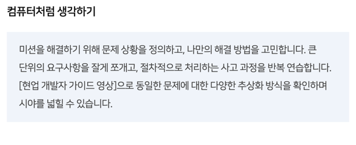
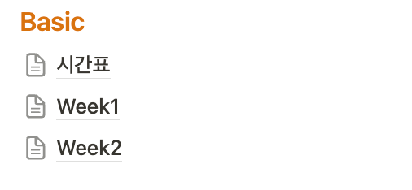
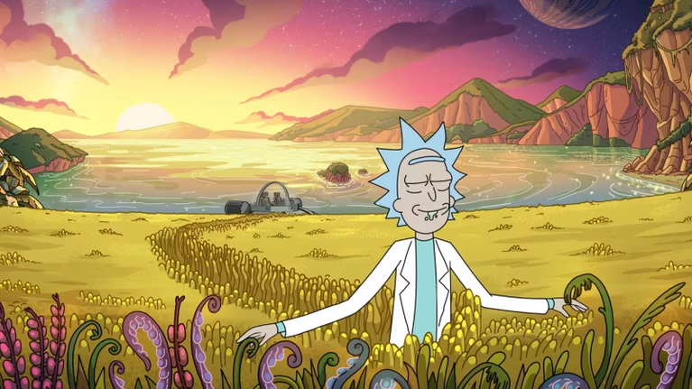
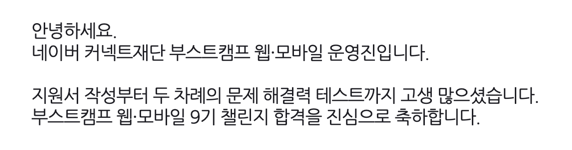

네이버 부스트캠프 9기 베이직 과정을 전체적으로 돌아보며 회고를 작성하려 합니다. 테스트 후기 등은 다른 글에서 작성하겠습니다.

## 베이직 이전까지

3년간 대학 생활을 하며 다양한 개발 작업을 했습니다. 나름 성과도 있었지만, "**작동하는 결과물**"에만 치중하였기에 개발자로서 역량은 아직 부족하다는 생각을 했습니다. 휴학 후 개인적인 학습을 하던 중, 주변에 좋은 평가를 받은 네이버 부스트캠프 공고를 확인하고, 지원을 결심했습니다. 열심히 준비한 서류 작성과 1차 테스트 이후, 2차 테스트 직행이 가능했지만 베이직 입과를 결심하였습니다.

베이직에서 제공되는 특별한 교육의 기회를 놓치고 싶지 않았기에 그러한 선택을 했고, 돌아와 생각해 보니 정말 잘한 결정이었구나 싶습니다.

## 베이직을 진행하며

**콘텐츠 이용 수칙이 있어 진행되는 미션과 같이 상세한 내용은 담을 수 없습니다.**

2주간 베이직 미션에 참여하며 쉬운 내용도, 어려운 내용도 있었습니다. 가장 마음에 들었던 점은 체계적인 데일리 미션들의 구성입니다. 단순히 난이도를 이야기하는 것이 아니라, 매일매일의 미션을 진행하다 보면 마치 베이직에서 어떤 것들을 얻어가면 좋을지 이야기하는 것 같은 기분이 들었습니다. 베이직을 따라가다 보니 어느새 다양한 분야의 Computer Science 지식, 협업, 프로그래밍 역량 등을 기를 수 있었습니다.

정답이 정해진 문제 아니기 때문에 혼자서 오랫동안 생각해보며 요구사항들을 나름대로 정의하거나 분석하고, 설계가 필요하다면 그것까지 작성하며 더 나은 결과물을 위해 고민하였습니다.

이런 과정을 혼자서 진행했다면 성장할 수 없었을 것 같습니다. 동료와 수료생 분들의 접근법을 확인하며 인상깊은 내용을 기록해 두고, 다음 날의 문제 해결에 적용했습니다. 이러한 과정을 매일 반복했고, 실제로 10일 간의 제출물을 확인해 보면 스스로 점점 **더 나은 코드**가 되어가고 있다고 느껴졌습니다.

## 마치며..

너무 긍정적이고 새로운 경험이었기에 느낀대로 거창하게 작성해 버렸네요. 사실 2주, 주말을 제외하면 10일이라는 짧은 기간이었습니다. 중요한 것은 이런 경험을 앞으로 활용할 저 자신이겠죠. 베이직에 몰입하느라 2차 테스트를 많이 준비하지 못했다고 생각했습니다. 우선 최선을 다하고, 결과에 연연하지 않자 다짐했습니다. 베이직의 **주도적인 학습 경험**을 잊지 않고 코드 작성 이전까지의 프로세스, 좋은 코드 작성을 포함한 모든 다짐들을 되새기기로. 그런데.. 바로 어제!

합격 소식을 받아 버렸습니다..! 미션을 수행하며 깊이 생각하고 다양한 코드를 읽었던 것이 하나의 훈련이 되었던 것 같습니다.
(미션과 테스트가 비슷하다는 것이 아닙니다)
다른 무엇보다 베이직에서의 성장 경험을 가장 밀접하게 이어갈 수 있는 기회라 생각해 너무나 뿌듯하고 벅찹니다.
이전에 부스트캠프 챌린지와 멤버십을 경험한 학교 선배 형님들이 겁을 주기도 했지만 아무리 힘들어도 몰입의 즐거움, 그리고 동료들이 함께할 거라 생각해 두렵지 않습니다.

정말 마지막으로.. 베이직을 준비해 준 운영진 및 수료생 분들, 그리고 함께한 동료 부스트캠퍼 분들께 모두 감사하다는 말을 하고 싶습니다!! 모두 건강하게 성장해서 다시 만나요 :D
