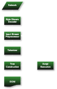

<!-- @import "[TOC]" {cmd="toc" depthFrom=1 depthTo=6 orderedList=false} -->

<!-- code_chunk_output -->

- [리눅스](#리눅스)
- [쉘 스크립트](#쉘-스크립트)

<!-- /code_chunk_output -->

### 리눅스

- Ubuntu 리눅스 설치
  - https://www.lainyzine.com/ko/article/how-to-install-ubuntu-linux/#google_vignette
  - https://www.lainyzine.com/ko/article/how-to-use-virtual-machines-on-apple-silicon-mac/
  - - ssh 연결 [https://velog.io/@zhy2on/Ubuntu-20.04-for-ARM-설치해보기](https://velog.io/@zhy2on/Ubuntu-20.04-for-ARM-%EC%84%A4%EC%B9%98%ED%95%B4%EB%B3%B4%EA%B8%B0)
- 로컬 컴퓨터, 리모트 컴퓨터, 가상 컴퓨터
  - 웹 서버 배포, 모바일 앱 배포 등의 상황에서 로컬 작업을 리모트 컴퓨터에 복제해야 한다.
  - 항상 물리적인 장치에서 실행이 불가능하므로 가상 컴퓨터를 만들어 사용한다.
- 리눅스 기본 디렉토리 구조
  ```bash
  /
  /home
  /boot
  /home/ubuntu
  /bin
  /etc
  ```
- 리눅스 ln 명령어 - 링크파일 생성
  - 링크파일은 연결로 지정된 파일 및 디렉토리에 접근해 읽고 쓰는 프로그램입니다.
  - 기본적으로 **하드 링크**를 만듭니다 (**동일한 내용의 다른 파일)**
  - -s 옵션으로 **심볼릭 링크**를 만듭니다 **(단순히 원본 파일을 가리키게 하며, ‘바로가기’와 유사합니다)**
  - 대상 파일이 이미 존재하는 경우 적용할 수 있는 다양한 옵션이 있습니다.

### 쉘 스크립트

- Shell이란?
  - os와 대화하는 프로그램
  - bash, zsh, .. (iterm에서 oh-my-zsh을 사용하고 있습니다)
  - [UNIX의 Shell은 다음과 같이 정의할 수 있다.](http://coffeenix.net/doc/shell_programming/shell1.htm)
    - Shell은 운영체제와 사용자 사이의 중계 역할을 하는 명령어 해석기(command interpreter)이다. 사용자와 시스템간의 대화를 가능하게 해 주는 것으로 사용자가 입력시킨 명령어 라인을 읽고서 필요한 시스템 기능을 실행시킨다.
    - Shell은 변수를 정의할 수 있고 조건문, 반복문, 산술 연산 등을 할 수 있는 완전한 프로그램 언어(program language)이다. 파일에 저장된 일련의 명령 군을 실행할 수 있으며, 제어 구조를 이용해 명령의 실행 순서를 바꿀 수 있다.
- 환경변수
  - 목록: term, shell, ssh_client, …
  - `$ export 변수명=값`
    새로운 환경변수 설정
  - `$ source [스크립트파일]`
    현재 쉘에서 스크립트 실행함
  - [.profile, .bashrc, .bash_profile] ⇒ 이들은 쉘은 시작할 때 자동으로 실행하는 스크립트들로 쉘 초기화할 때 사용함.
- Shell Script 기본 구조
  ```bash
  #!/bin/bash
  echo "Hello Linux!!"
  ```
  - `#!/bin/bash` - Unix 계열 Shell Script 파일의 필수적인 구문. Script 파일 최상단에 해당 파일을 해석해 줄 인터프리터의 절대경로를 지정해 준다.
  - vi 등의 에디터로 파일 생성과 함께 작성하며, 실행을 위해서는 chmod로 x(실행) 권한을 주어야 한다.
- 변수 선언시 공백을 두어선 안된다. 호출할 때는 $ 혹은 ${}를 사용한다.

  ```bash
  #변수 선언, 대소문자 구분 및 =사이에 공백 X
  num=100
  str="hello"

  # $을 이용한 변수 호출
  echo "$num"
  echo "$str"

  #또는
  echo "${num}"
  echo "${str}"
  ```

  ```bash
  VAR1=$#
  echo "num=$#"
  echo "parameters: $0 $1 $2 $3"
  echo "parameters: $@"
  echo "VAR1 = $VAR1"
  echo 'VAR1 = $VAR1'
  echo VAR1=`ls`
  ```

  

  - 위 코드에서 VAR1에는 스크립트에 전달된 인수의 개수를 저장한다.
  - $0은 파일 이름, $1, $2, $3은 전달 받은 1번째~3번째 인수이다.
  - $@는 모든 인수를 문자열로 출력한다.
  - `‘’` 는 문자열을 그대로 출력한다.
  - ```(백틱)은 명령어의 결과를 그대로 출력한다.

    ```

  - ./variable.sh가 아닌 sh variable.sh를 사용하듯 파일을 실행할 때 인터프리터를 명시할 수 있다. 이는 스크립트 파일 첫 줄의 인터프리터 정보를 무시한다.

- 배열은 소괄호로 묶고, 띄어쓰기로 구분
- 조건문은 대괄호로 나타내며, -eq, -ne, -gt, -ge, -le, -lt 등의 비교 연산자가 있다.
- 입력과 출력 방향을 바꿀 수 있다.
- `|` 이전 프로그램의 표준 출력이 이후 프로그램의 표준 입력으로
- 키보드 입력을 받을 수 있다.
- 파일, 디렉토리, 문자열의 특징들을 확인할 수 있다.

### crontab이란?

리눅스 스케줄링 관리 프로그램

- `crontab -e`: 크론탭 실행
- `crontab -l`: 크론탭 출력해서 확인
- `crontab -r`: 크론탭 삭제
- 기본 형태: `* * * * *`로, 각각 `분, 시간, 일, 월, 요일`을 의미합니다.
  ```
  * * * * * ls -al
  * * * * * /home/user/script.sh
  ```
  위와 같이 별 혹은 숫자 다섯개, 명령어 혹은 실행시킬 파일 등을 작성하면 됩니다.
