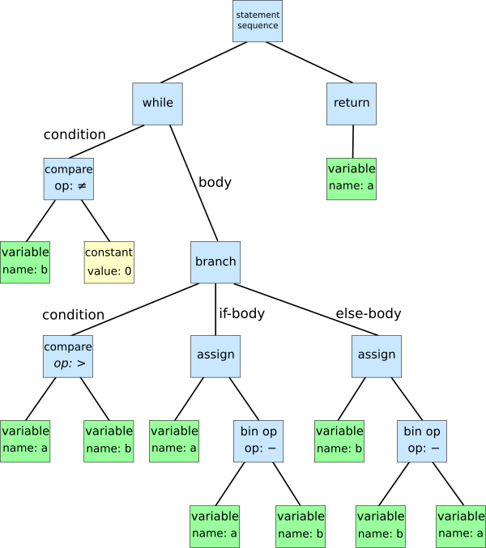
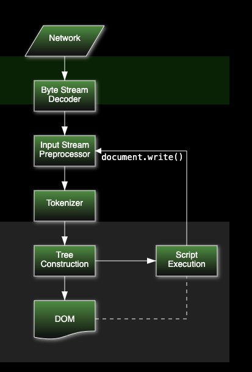
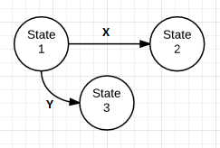

<!-- @import "[TOC]" {cmd="toc" depthFrom=1 depthTo=6 orderedList=false} -->

<!-- code_chunk_output -->

- [컴파일러 이론 Parsing](#컴파일러-이론-parsing)
  - [AST (Abstract Syntax Tree) 추상 구문 트리](#ast-abstract-syntax-tree-추상-구문-트리)
  - [tokenizer, lexer, parser](#tokenizer-lexer-parser)
- [브라우저 DOM Parser](#브라우저-dom-parser)
  - [DOM](#dom)
  - [브라우저 DOM Parser](#브라우저-dom-parser-1)
  - [DOMParser 동작 방식](#domparser-동작-방식)
  - [Parsing HTML documents](#parsing-html-documents)
- [XML](#xml)
  - [Well-formed XML](#well-formed-xml)
  - [XML 사용 이유](#xml-사용-이유)
  - [태그를 찾는 정규 표현식 Regex](#태그를-찾는-정규-표현식-regex)

<!-- /code_chunk_output -->

## 컴파일러 이론 Parsing

### AST (Abstract Syntax Tree) 추상 구문 트리



- 소스 코드의 추상 구문 구조의 트리입니다.

  - 프로그램 분석 혹은 변환 시스템에서 사용됩니다.
  - 소스 코드의 괄호 등 세세한 정보는 제외합니다.

### tokenizer, lexer, parser

- 컴파일러의 첫 단계 구문분석은 tokenizer, lexer, parser의 과정을 포함합니다.

- tokenizer: 토큰 쪼갭니다.
- lexer: 쪼갠 토큰에 의미 부여합니다.
  - lexer를 tokenizer의 일종으로 보기도, tokenizer 안에 lexer를 함께 구현하기도 합니다.
- parser: 토큰들을 구조적으로(AST) 나타내 원래 프로그램 코드 텍스트를 표현합니다.

- 단계적으로 세개 과정의 결과를 살펴보면
- tokenizer
  ```
  [ "1", "[2,[3]]", "['he', 'is', 'tall']"]
  ```
- lexer
  ````[
  {type: 'number', value:"1" },
  {type: 'array', value: "[2, [3]]"},
  {type: 'array', value: "['he', 'is', 'tall']"},
  ]```
  ````
- parser

  ```{
  type: 'array',
  child: [
  {type: 'number', value:'1', child:[] },
  {type: 'array',
  child: [
  { type: 'number', value: '2', child:[] },
  { type: 'array',
  child:[ {type:'number', value:'3', child:[]}
  ]
  }]
  },
  {type: 'array',
  child:[
  { type: 'string', value: 'he', child:[] },
  { type: 'string', value: 'is', child:[] },
  { type: 'string', value: 'tall', child:[] },
  ]
  }]
  }
  ```

- 최종적으로 출력된 결과가 AST 형태입니다. 이를 토대로 이후에 compiler가 다음 작업을 수행합니다.

- 다시 한번 말하자면 순서대로
  - tokenizer -> lexer -> parser
  - 토큰화 → 토큰의 어휘 분석해 의미 부여 → 문법을 체크하며 구조적으로 나타냄
- 일반적인 토큰 종류는 다음과 같습니다.

  | 토큰이름   | 샘플                      |
  | ---------- | ------------------------- |
  | identifier | HTML, BODY                |
  | separator  | <, >, [, ], ,             |
  | operator   | +, <, =                   |
  | literal    | true, NULL, 3.14, "hello" |
  | comment    | <!코멘트는 무시>          |

- 다양한 활용 예시가 있습니다.
  - tokenizer와 lexer를 한번에 처리하는 방식도 자주 사용됩니다.
  - 상황에 따라 적절한 토큰화를 사용해야 합니다.

## 브라우저 DOM Parser

### DOM

- Document Object Model (문서 객체 모델)
- 웹페이지의 소스 코드 태그들을 JS가 활용할 수 있는 객체로 만들며, 트리 구조를 띕니다.

### 브라우저 DOM Parser

xml 혹은 html 소스 코드를 DOM 문서 문자열로 만들어 줍니다. cf. 반대 작업은 XMLSerializer에서 가능합니다.

[MDN web docs DOMParser](https://developer.mozilla.org/en-US/docs/Web/API/DOMParser)https://developer.mozilla.org/en-US/docs/Web/API/DOMParser

- 생성자

  ```js
  new DOMParser();
  ```

  - 새로운 DOMParser 객체를 생성합니다.

- DOMParser.parseFromString()

  ```js
  parseFromString(string, mimeType);
  ```

  - string: parse 될 문자열(html, xml, svg 등의 문자열)이 들어갑니다.
  - mimeType: 아래 값들을 토대로 위 문자열이 어떤 타입인지 알립니다.
    - `text/html`
    - `text/xml`
    - `application/xml`
    - `application/xhtml+xml`
    - `image/svg+xml`
  - 각 mimeType에 해당하는 parser를 호출하고, 결과 Document를 반환합니다.
  - `<script>` 요소들은 non-executable로 실행되지 않게 마킹되고, `<noscript>` 요소들은 마크업으로 파싱됩니다.

### DOMParser 동작 방식

[HTML Stendard Specification - DOM Parser](https://html.spec.whatwg.org/multipage/dynamic-markup-insertion.html#domparser)

- new DOMParser는 별다른 동작을 하지 않습니다.
- parseFromString(`string`, `type`)는 다음과 같이 동작합니다.

1. *compilantString*가 Get Trusted Type compilant string 알고리즘을,
   TrustedHTML, this의 relevant global object, `string`, "DOMParser parseFromString", 그리고 "script"에 적용한 결과가 되게 합니다.

2. document가 콘텐츠 타입은 `type`이고 URL은 현재 객체this의 관련 전역 객체relevant global object와 연관된 Document의 URL을 가진 새로운 Document가 되게 합니다.
   cf. 문서의 인코딩은 기본값인 UTF-8로 남겨집니다. 특히, compliantString을 파싱하는 동안 발견된 모든 XML 선언이나 메타 요소는 아무런 영향을 미치지 않습니다.

3. `type`에 따라 분기합니다:

   - “text/html”
     document와 compliantString을 사용하여 문자열에서 HTML을 파싱합니다.
     document가 탐색 컨텍스트를 가지지 않으므로, 스크립팅은 비활성화됩니다.

   - 그 외의 `type`

     1. XML 스크립팅 지원이 비활성화된, document와 연결된 XML 파서를 생성합니다.

     2. parser를 사용하여 compliantString을 파싱합니다.

     3. 이전 단계가 XML 잘 형성됨 또는 XML 네임스페이스 잘 형성됨 오류를 초래한 경우:

        1. document에 자식 노드가 없음을 확인합니다.

        2. document, “parsererror”, 그리고 “http://www.mozilla.org/newlayout/xml/parsererror.xml”을 사용하여 요소를 생성한 결과인 root를 생성합니다.

        3. 선택적으로, root에 속성이나 자식을 추가하여 파싱 오류의 성격을 설명할 수 있습니다.

        4. root를 document에 추가합니다.

4. document를 반환합니다.

- 주어진 Document document와 문자열 html로부터 HTML을 파싱하려면:

  1. document의 타입을 “html”로 설정합니다.

  2. document와 연결된 HTML 파서를 생성합니다.

  3. html을 parser의 입력 스트림에 넣습니다. 인코딩 신뢰도는 중요하지 않습니다.

  4. parser를 시작하고 입력 스트림에 방금 삽입된 모든 문자를 소비할 때까지 실행되도록 합니다.

     cf. 이는 document의 mode를 변형할 수 있습니다.

정확히 Parsing이 어떻게 일어나는지는 말하지 않고, 그 매개변수와 최종 결과 값이 어떻게 처리되는만 나와 있네요. 다시 한번 알아봅시다.

### Parsing HTML documents

[HTML Stendard Specification - html parser](https://html.spec.whatwg.org/multipage/parsing.html#html-parser)


HTML 파싱 프로세스의 input은 code point(유니코드 포인트)의 stream(연속적인 데이터 흐름)으로 구성되어 있습니다. 이는 tokenization과 tree construction 단계로 전해지고, 그 결과로 Document (DOM) 객체가 나옵니다.

- Tokenization
  
  먼저, 상태 머신에 대해 알아야 하는데, 이는 위 그림과 같이 특정 조건에 따라 전환되는 상태를 나타내는, 알고리즘의 수학적 추상화 표현입니다.

  토큰화는 다음 상태 머신 state machine을 사용하는 것과 같이 구현됩니다.

  상태 머신은 data state에서 시작합니다.
  대부분의 상태는 **하나의 문자**를 사용하는데, 이는 다양한 부작용이 있을 수 있습니다.
  상태 기계는 새로운 상태로 전환하여 현재 입력 문자를 다시 소비하거나, 다음 문자를 소비하도록 상태를 전환하거나, 같은 상태에 머물러 다음 문자를 소비합니다.
  일부 상태는 더 복잡한 동작을 하며 여러 문자를 소비한 후 다른 상태로 전환할 수 있습니다. 경우에 따라 트리 구축 단계에서도 토크나이저 상태가 변경될 수 있습니다.

  tokenization의 결과로 0개 이상의 다음과 같은 토큰이 반환됩니다.
  DOCTYPE, 여는 태그, 닫는 태그, 주석, 문자, eof(end-of-file) (html 기준입니다)

- Tree Construction
  토큰들을 input으로 받으며, output으로 document의 DOM tree에 대한 동적인 수정 및 확장을 합니다. 각 토큰이 tokenizer에서 방출될 때, tree construction dispatcher라는 단계를 따릅니다. 간단히 설명하자면:

  열린 요소의 스택(stack of open elements)을 사용합니다.
  현재 노드의 상태에 따라 다음과 같이 처리합니다:

  - 스택이 비어있는 경우
  - 현재 노드가 HTML 네임스페이스의 요소인 경우
  - 현재 노드가 MathML 텍스트 통합 지점인 경우
  - 현재 노드가 HTML 통합 지점인 경우
  - 토큰이 파일의 끝을 나타내는 경우

  위 조건에 따라 HTML 콘텐츠의 현재 삽입 모드에 해당하는 규칙으로 토큰을 처리하거나, 외부 콘텐츠 파싱 규칙에 따라 처리합니다.
  필요한 경우 foster parenting(잘못된 위치에 삽입된 요소 처리 기술)을 사용하여 테이블 관련 요소들을 올바르게 처리합니다.
  노드 삽입 위치를 결정하고 조정하는 알고리즘을 사용하여 DOM 트리를 구성합니다.

  이 과정을 통해 입력된 토큰들이 DOM 트리로 변환되어 문서의 구조를 형성합니다.

  스택을 사용하며 순회하고 새로운 요소를 만나면 자식 요소를 먼저 처리하고 형제 요소를 처리한다는 점에서 매우 복잡한 DFS 알고리즘의 활용이라고 볼 수 있습니다.

## XML

XML(Extensible Markup Language)은 데이터를 정의하는 규칙을 제공하는 마크업 언어입니다.

### Well-formed XML

Well-formed XML은 XML 문서가 XML의 기본 문법 규칙을 준수하고 있음을 의미합니다. 이러한 문서들은 XML 파서에 의해 잘 처리되며, 올바른 XML 구조를 가지고 있습니다. 간단히 설명하자면 규칙은 다음과 같습니다:

1. 루트 요소: XML 문서는 단 하나의 루트 요소를 가져야 합니다.
2. 태그 쌍: 모든 시작 태그는 종료 태그와 쌍을 이루어야 합니다. 예: <tag>내용</tag>.
3. 태그 중첩: 태그는 중첩이 올바르게 이루어져야 하며, 열리는 태그와 닫히는 태그의 순서가 일치해야 합니다.
4. 속성 값: 속성 값은 큰따옴표(") 또는 작은따옴표(')로 묶여야 합니다.
5. 문자 인코딩: XML 문서의 문자 인코딩 선언이 명시적이어야 합니다 (<?xml version="1.0" encoding="UTF-8"?>).

### XML 사용 이유

데이터의 구조화와 전송에 있어 유리하며, 유연성과 호환성을 제공합니다.

1. 데이터 구조화: XML은 데이터의 계층적 구조를 표현할 수 있어 복잡한 데이터 구조를 명확하게 정의할 수 있습니다. 이는 데이터의 표현과 해석을 일관되게 유지하는 데 도움을 줍니다.
2. 표준화: 플랫폼과 언어에 독립적이어서 다양한 시스템 간에 데이터 교환이 용이합니다.
3. 확장성: 사용자 정의 태그를 지원하므로 특정 요구사항에 맞게 태그와 구조를 자유롭게 정의할 수 있습니다.
4. 메타 데이터를 표현하기 좋으며, 태그의 순서가 명확하게 유지된다는 장점

### 태그를 찾는 정규 표현식 Regex

- `/<[^>]+>|[^<]+/g` - XML 태그나 텍스트 내용을 찾습니다.
  - `<`: 문자 '<'로 시작
  - `[^>]+`: '>'를 제외한 모든 문자가 1회 이상 반복
  - `>`: 문자 '>'로 끝남
  - `|`: 또는
  - `[^<]+`: '<'를 제외한 모든 문자가 1회 이상 반복
  - `/g`: 전역 검색 (모든 일치 항목 찾기)
