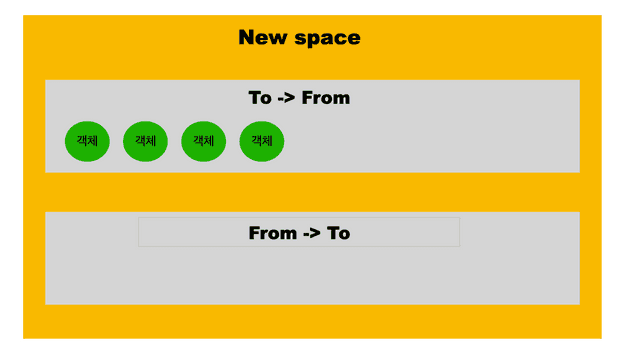

<!-- @import "[TOC]" {cmd="toc" depthFrom=1 depthTo=6 orderedList=false} -->

<!-- code_chunk_output -->

- [CS:APP 가상 주소 (c언어 프로그램 기준)](#csapp-가상-주소-c언어-프로그램-기준)
- [NodeJS 프로세스 메모리 관리 방식](#nodejs-프로세스-메모리-관리-방식)
  - [V8엔진](#v8엔진)
  - [NodeJS 메모리 구조](#nodejs-메모리-구조)
  - [NodeJS 가비지 콜렉션](#nodejs-가비지-콜렉션)
- [힙 메모리 단편화fragmentation 해결책](#힙-메모리-단편화fragmentation-해결책)
  - [리눅스 가상 메모리 현황 확인 방법](#리눅스-가상-메모리-현황-확인-방법)
- [NodeJS Process/OS 모듈](#nodejs-processos-모듈)
  - [Process 모듈 ⭐️⭐️](#process-모듈-️️)
  - [OS 모듈](#os-모듈)
- [추가 학습 자료](#추가-학습-자료)

<!-- /code_chunk_output -->

## CS:APP 가상 주소 (c언어 프로그램 기준)


**가상 메모리**란 결국 추상화 개념입니다.
이는 각 프로세스가 메인 메모리를 배타적으로 사용하는 것처럼 보이게 합니다.
각 프로세스는 **가상 주소 공간**이라는 동일한 형태의 메모리를 갖습니다. 리눅스 프로세스의 가상 주소 공간은 위 그림과 같습니다.

이는 각각 특별한 목적을 가진 여러 영역들로 구성됩니다. 리눅스에서 주소 공간의 최상위 영역(그림에서 가장 아래 Read-only code and data, 주소는 아래에서 위로 증가): 모든 프로세스에 공통으로 사용되는 운영 체제의 코드와 데이터가 할당됩니다. 그 바로 아래 Read/write data 영역에는 사용자의 프로세스에 의해 정의된 코드와 데이터를 포함합니다.

- Program code and data (7. Linking에서 자세히)
  code 영역은 모든 프로세스가 같은 고정된 주소에서 시작됩니다. 이어서 global C 변수에 대응되는 data 영역이 나옵니다.
  code, data 영역은 실행 파일의 내용으로 바로 초기화됩니다.

- Heap (9. Virtual Memory에서 자세히)
  code, data 영역 이후에는 런타임 *heap*이 있습니다. 고정된 크기의 code and data 영역과 달리, 힙은 런타입 동안 동적으로 확장하고 수축합니다. C 표준 라이브러리의 malloc, free으로 이루어 집니다.
  [주의: priority queue로 구현되는 _heap_ 자료구조와는 직접적인 연관이 없습니다.](https://stackoverflow.com/questions/756861/whats-the-relationship-between-a-heap-and-the-heap)

- Shared libraries (7.10 Dynamic Linking with Shared Libraries에서 자세히)
  주소 공간의 중간 즈음에는 C 표준 라이브러리나 math와 같은 *shared libraries*의 코드와 데이터를 위한 영역이 있습니다.

- Stack (3. Machine-Level Representation of Programs에서 자세히)
  사용자의 가상 주소 공간의 상단에는 컴파일러가 함수 호출function call을 구현하기 위해 사용하는 *user stack스택*이 있습니다. 힙과 마찬가지로, 스택은 프로그램 실행 도중 동적으로 확장하고 수축합니다. 특히 우리가 함수를 호출할 때, 스택이 자라나고 반환return할 때 스택이 수축합니다.

- Kernel virtual memory
  주소 공간의 가장 위는 커널을 위해 할당되어 있습니다. 응용 프로그램application program은 이 영역에 읽기/쓰기 작업이 불가하며 여기 정의된 함수를 호출할 수도 없습니다. 대신, 커널을 불러 이러한 동작을 수행해야 합니다.

- 동작 (9. Virtual Memory)
  가상 메모리가 작동하려면, 하드웨어와 운영 체제 소프트웨어 간의 정교한 상호작용이 필요합니다. 여기에는 프로세서가 생성한 모든 주소의 하드웨어 변환이 포함됩니다. 관련된 기본적인 아이디어는 프로세스의 가상 메모리 내용을 디스크에 저장한 다음, 메인 메모리를 디스크의 캐시로 사용하는 것입니다. 9장은 이것이 어떻게 작동하는지와 현대 시스템의 운영에 왜 중요한지 설명합니다.

## NodeJS 프로세스 메모리 관리 방식

### V8엔진

Javascript를 브라우저에서 돌려주는 엔진으로, Javascript를 assembly code로 컴파일해줍니다.
NodeJS는 V8엔진을 C++로 wrapping해서 OS가 이해할 수 있게 해주는 자바스크립트 런타임(실행환경)입니다.

- V8 엔진은 메모리를 3개 섹션으로 구분합니다.
  - code, stack, heap
- NodeJS 어플리케이션이 시작되면, 다음과 같은 워크플로우를 따릅니다.
  - V8이 힙을 할당해 줍니다.
  - 어플리케이션이 힙을 채웁니다.
  - V8 가비지 콜렉션이 작동해 힙을 청소합니다.
  - 만약 힙이 가득차면 V8이 힙의 크기를 늘립니다.
- 아래와 같은 메모리 생존 주기에 대한 설명도 있습니다.

  1. 할당

  - 원시 타입의 값들은 *스택 영역*에 할당됩니다.
  - 참조 타입의 값들은 *힙 영역*에 저장되며, 그 주소값은 *스택 영역*에 저장됩니다.
  - 변수 식별자 또한 스택 영역에서 실행 컨텍스트의 렉시컬 환경에 저장됩니다.

    - 1. 실행 컨텍스트 (Execution Context): 함수가 호출될 때마다 생성되는 환경으로, 해당 함수가 실행되는 동안 필요한 모든 정보(변수, 함수 선언, this 바인딩 등)를 포함합니다.
    - 2. 렉시컬 환경 (Lexical Environment): 실행 컨텍스트의 구성 요소로, 현재 스코프에서 변수와 함수 선언을 저장하는 객체입니다. 렉시컬 환경은 환경 레코드(Environment Record)와 외부 환경 참조(Outer Environment Reference)로 구성됩니다.

    따라서, “변수 식별자가 스택 영역 상의 실행 컨텍스트의 렉시컬 환경에 저장된다”는 표현은, 변수 식별자와 그 값이 스택 메모리 내에 있는 실행 컨텍스트의 렉시컬 환경에서 관리된다는 의미로 해석할 수 있습니다. 이는 변수의 이름과 값이 실제로 스택 메모리 내의 특정 위치에 저장되는 것이 아니라, 스택 메모리에 있는 실행 컨텍스트 구조를 통해 관리된다는 뜻입니다.

  ```js
  const a = 10; // primitive 타입은 메모리 스택 영역에 저장
  const b = [1, 2, 3]; // 배열, 함수, 객체는 힙 영역에 저장
  ```

  

  2. 참조
     v8 엔진에 의해 전역 실행 컨텍스트 렉시컬 환경에 있는 식별자 a, b를 참조합니다.

     ```js
     console.log(a); // 10

     console.log(b[0]); // 1
     ```

  3. 가비지 콜렉션
     - 먼저 v8 엔진의 프로세스 메모리 구조를 알아보고 아래에서 자세히 설명합니다.

### NodeJS 메모리 구조

[자바스크립트 v8 엔진의 가비지 컬렉션 동작 방식](https://fe-developers.kakaoent.com/2022/220519-garbage-collection/)


- 프로그램이 실행되면 메모리의 Resident Set이라는, 스택과 힙으로 이루어진 빈 공간이 할당됩니다. js는 싱슬 스레드이기 때문에 스택 메모리를 하나만 가집니다. 스택은 함수 호출 이후 OS에 의해 정리되지만, 힙 메모리는 그렇지 않으므로 가비지 콜렉션의 대상이 됩니다.
- 힙은 크게 아래의 Old/New 두개의 공간으로 분할되며, 이는 generations라 불립니다. 더 많은 영역이 있지만(Large Object space, 코드 space, 셀 space, 속성 space, 맵 space), 우선 아래 2개 공간에 집중합니다.

1. Old space
   - 오래된 객체가 저장되어 있습니다. 대체로 아래 *New space*에서 2번의 가비지 컬렉션 동안 살아남은 객체들이 이곳으로 옮겨집니다. 이 *old space*는 command line api `node --max-old-space-size`로 제어할 수 있습니다. 이 영역은 아래 2개로 다시 나뉩니다.
   - Pointer space: 다른 객체를 참조하는 객체, 즉 다른 객체에 대한 포인터를 가진 객체
   - data space: 문자열, 실수 등의 데이터만을 가진 객체
2. New space
   - 대부분의 객체가 이곳에 할당됩니다.
   - new space는 가비지 콜렉션 사이클을 한 번 살아남은 객체부터 방금 막 할당된 객체의 공간으로 나뉩니다.
   - new space로의 할당은 비용이 적지만, 1~8MB의 작은 사이즈로 되어 있습니다. 따라서, 새로운 객체가 old space에 할당되는 것을 막기 위해 가능한 빨리 객체를 없애 메모리를 비우는 것이 좋습니다.

### NodeJS 가비지 콜렉션


- New space는 다시 2개의 semi space로 나뉘는데, 객체는 처음에 New space의 첫 번째 semi space에 할당됩니다. 만약 가비지 콜렉션에서 한 번 생존한다면, 다른 semi space로 이동합니다. 그리고 생존한 객체들이 또 한 번 GC로부터 생존하면, Old space로 이동합니다. 이처럼 New space에서 일어나는 2번의 가비지 콜렉션이 Minor GC(Gargage Collection)입니다.

- 이러한 동작 방식은 *The Generational Hypothesis*에서 시작되는데, 새로운 객체가 오래된 객체보다 쓸모 없어질 가능성이 높다는 가설을 의미합니다. 따라서 쓸모없어질 가능성이 낮은 오래된 객체는 매번 검사하지 않습니다.

1. 마이너 GC (Scavenger)
   

   - 가비지 콜렉션에서 살아남아 이전의 From space에서 비어있던 To space로 이동할 때, 객체들은 연속적인 주소로 이동하며 이는 메모리 단편화를 주기적으로 방지합니다. 이때 객체 참조는 새로운 주소값으로 갱신되고, 모든 객체가 이동하고 나면 From space와 To space의 역할을 바꿔 다음 번 가비지 콜렉션을 대비합니다.
     
   - 다음번 가비지 콜렉션 후에는 생존 횟수를 기억해 다시 한 번 생존한 객체를 Old space로 이동시킵니다.
     

2. 메이저 GC
   Old space의 메이저 GC는 Mark-Sweep-Compact, Tri-color의 2개 알고리즘을 사용합니다.
   
   기본적으로 roots 객체들과 자식 객체들을 순회하며 미탐색(white)/해당 객체 탐색(grey)/자식 객체까지 탐색(black)의 상태로 구분하고, dfs가 끝난 이후에도 흰색으로 마킹된(roots와 연결이 끊겨 미탐색) 메모리 주소를 free-list라 불리는 자료구조에 추가해 새로운 객체가 저장되게 합니다.
   이때, Compact 압축 과정이 추가되어 메모리 단편화가 심한 페이지들은 재배치하여 추가 메모리를 확보합니다.

- 이때, 가비지 콜렉션 자체는 어떻게 동작하냐! 간단히 설명하자면 다음과 같습니다.[Node.js GC Explained](https://blog.risingstack.com/node-js-at-scale-node-js-garbage-collection/#theheap)

1. {: width="150" height="200"}

- 초기 상태가 위와 같다고 생각해 봅시다.

2. {: width="150" height="200"}

- root 객체로부터 더이상 연결되지 않는 객체가 생기면, 이는 더이상 사용되지 않는 죽은 객체가 되어 가비지 콜랙션의 대상이 됩니다.

3. {: width="150" height="200"}

- 위 그림과 같이 root 객체에서 참조 연결이 끊어진 M 객체는 가비지 컬렉션이 작동하여 삭제됩니다.

- cf. NodeJS V8 가비지 콜렉션 방식의 장단점

  - 자동으로 이루어져 언어가 단순화되고, 메모리 누수 문제를 해결할 수 있지만,
  - 반대로 메모리 제어권이 없어져 섬세한 메모리 관리가 불가능해집니다.
  - 또한, 가비지 콜렉션은 프로그램을 잠시 멈추게 하며, 이외에도 결국 컴퓨팅 자원을 사용한다는 단점이 있다.

- Orinoco: 이러한 가비지 콜렉션의 stop-the-world(프로그램 멈춤) 문제를 해결하기 위한 프로젝트입니다. 아래 내용을 포함합니다.
  - prallel: 기존에는 메인 쓰레드 혼자 하던 일을 헬퍼 쓰레드들과 균등하게 나누어 일을 합니다. 쓰레드 간의 동기화를 처리해야 해서 오버헤드는 생기지만 stop-the-world 시간이 크게 감소합니다.
  - incremental: 메인 쓰레드가 적은 양의 작업을 간헐적으로 처리합니다. 메인 스레드에서 가비지 컬렉션에 소요하는 시간이 분산되어, 좋은 UX를 제공할 수 있습니다.
  - concurrrent: 메인 쓰레드는 더 이상 가비지 컬렉션을 하지 않고, 헬퍼 쓰레드들이 수행합니다. 기술적으로 구현하기는 어렵지만, 메인 쓰레드의 stop-the-wolrd 시간이 전혀 없다는 큰 장점이 있습니다.
  - idle-time GC: 개발자는 GC에 직접 접근할 수 없습니다. 하지만 v8은 크롬과 같은 embedder에게 가비지 컬렉션을 유발할 수 있는 메커니즘을 제공합니다. 크롬은 프로그램이 쉬는 free나 idle time을 알 수 있습니다. 예를 들면, 1초에 60프레임을 제공하는 크롬은 1프레임을 렌더링 하기 위해 약 16ms(1s / 60)가 소모됩니다. 만약 애니메이션 프레임 렌더링 작업이 16ms 보다 빨리 끝나면, 크롬은 다음 프레임 작업 전까지 가비지 컬렉션을 유발합니다.

## 힙 메모리 단편화fragmentation 해결책

- 내부 단편화: 메모리를 할당할 때 프로세스가 필요한 양보다 더 큰 메모리가 할당되어서 프로세스에서 사용하는 메모리 공간이 낭비 되는 현상
- 외부 단편화: 메모리가 할당 및 해제 작업의 반복으로 작은 메모리가 중간중간에 존재 중간중간에 생긴 사용하지 않는 메모리가 존재해서 총 메모리 공간은 충분하지만 실제로 할당할 수 없는 상황

1. Paging 페이징
   
   - 프로세스를 일정 크기로 잘게 쪼개어 순서와 상관없이 적재하는 방식
   - 단점: 페이지 프레임 단위로 쪼개면서 내부 단편화 문제의 비중이 늘어난다.
2. Segmentation 세그맨테이션
   
   - 고정된 크기 페이징 테이블과 달리 서로 다른 크기의 논리적 단위, 세그먼트Segment로 분할
   - 각각 시작 주소, 세그먼트 크기를 갖는다.
   - 단점: 서로 다른 크기의 세그먼트들이 적재되고 제거되는 일이 반복되다 보면, 작은 조각의 자유 공간들이 많아지면서 외부 단편화 증가
3. Memory pool
   
   - 고정된 크기의 블록을 할당하여 메모리 동적 할당을 가능하게 한다.
   - memory pool이라 불리는 동일한 사이즈의 메모리 블록들을 미리 할당하고 프로세스들이 필요할 때마다 사용하고 반납한다.
   - 할당 해제가 빈번할 때 효과적이다. 외부/외부 단편화는 없다.
   - 미리 할당해 두기 때문에 메모리 누수 memory leak가 있다.

### 리눅스 가상 메모리 현황 확인 방법

- cat /proc/meminfo
  
- top 명령어
- vmstat(virtual memory statistic reporter) 명령어
  
  - Procs: processes
    - r: 실행 중인 프로세스 수
    - b: 중단 없는 수면 상태 프로세스 수
  - Memory
    - swpd: 사용 중인 가상 메모리 사이즈
    - ...
- pmap
  - sudo pmap -x 프로세스ID
  - 해당 프로세스의 메모리 주소 및 사용량을 확인할 수 있습니다.
    
    - RSS: 실제 할당 공간
    - Mapping: 할당 목적

## NodeJS Process/OS 모듈

### Process 모듈 ⭐️⭐️

현재 NodeJS 프로세스에 관한 정보와 제어를 제공합니다. `process`는 이벤트 리스너를 등록하고 이벤트를 발생시키는 `EventEmitter` 클래스의 인스턴스입니다.
[공식 문서 전체 api](https://nodejs.org/api/process.html)

- process.constrainedMemory(), availableMemory()
  - 각각 프로세스가 처음 할당 받은 메모리 양, 현재 가용한 free 메모리 양을 바이트 단위로 반환합니다.
- process.cpuUsage
  - user, system CPU 시간 사용량을 반환합니다. 다수 코어가 있다면 실제 경과 시간보다 크게 측정됩니다. 이전 결과 값을 인자로 넘겨 차이를 구할 수 있습니다.
- process.dlopen()
  - shared 객체를 동적으로 로딩할 수 있게 합니다.
  - c++ 애드온을 로드하기 위한 require()문에서 사용됩니다.
- process.memoryUsage()
  메모리 사용량 정보를 담은 객체를 반환합니다.

  ```js
  const { memoryUsage } = require("node:process");

  console.log(memoryUsage());
  // Prints:
  // {
  //  rss: 4935680,
  //  heapTotal: 1826816,
  //  heapUsed: 650472,
  //  external: 49879,
  //  arrayBuffers: 9386
  // }
  ```

  - `rss`: Resident Set Size, C++, JS 객체와 코드를 모두 포함해 프로세스가 차지하는 메인 메모리 공간
  - `heap`: V8 엔진의 메모리 사용량
  - `external`: V8이 관리하는 JS 객체에 바인딩된 C++ 객체의 메모리 사용량
  - `arrayBuffers`: `ArrayBuffer`, `SharedArrayBuffer에` 할당된 메모리로, NodeJS의 Buffer 또한 포함합니다. `external에도` 포함되어 있으며, NodeJS가 임베딩된 라이브러리인 경우 `arrayBuffers` 값은 추적되지 않아 0이 됩니다.

- **process.nextTick(callback[, .../args])**

  - 다음 tick queue에 콜백을 추가합니다. 이 큐는 JS 스택의 연산이 전부 수행되고 event loop가 계속되도록 허용되기 전에 완전히 비워집니다.
  - 재귀적으로 호출되면 무한 루프를 만들 수 있습니다.
  - API를 제작할 때 사용자가 이벤트 핸들러를 객체 생성 이후, I/O 발생 이전에 적용할 수 있게 한다는 점에서 중요합니다.

    ```js
    const { nextTick } = require("node:process");

    function MyThing(options) {
      this.setupOptions(options);

      nextTick(() => {
        this.startDoingStuff();
      });
    }

    const thing = new MyThing();
    thing.getReadyForStuff();
    // thing.startDoingStuff()은 다음 틱인 정확히 이 시점에 호출됩니다.
    ```

    어떠한 API가 완전한 동기 혹은, 완전한 비동기로 구현되도록 하는것은 매우 중요합니다. 다음 상황을 봅시다.

    ```js
    const maybeTrue = Math.random() > 0.5;

    maybeSync(maybeTrue, () => {
      foo();
    });

    bar();
    ```

    ```js
    function maybeSync(arg, cb) {
      if (arg) {
        cb(); // 해결책: nextTick(cb);
        return;
      }

      fs.stat("file", cb);
    }
    ```

    위 상황에서, maybeTrue가 true라면 콜백 함수로 전달되 foo()가 먼저 실행되지만, false일 때는 fs.stat()이 비동기 함수이므로 bar()이 먼저 실행되고 마칩니다.
    **이를 해결하기 위해 nextTick(cb)를 적용해 항상 bar()이 먼저 실행되게 합니다.**

- process.stdin, process.stdout
  - stdin/stdout과 연결된 stream을 반환합니다. 파일을 참조하지 않는다면 이는 읽기 쓰기가 모두 가능한 duplex Stream인 net.Socket()입니다.
  - cf. net.Socket 클래스
    - TCP socket 혹은 streaming IPC endpoint의 추상화입니다. 이 역시 EventEmitter입니다. 사용자가 서버와 직접 상호작용하기 위해 만들고 사용할 수 있습니다. 한 예로, `net.createConnection()`이 net.Socket을 반환하여 사용자가 서버와 대화할 수 있게 됩니다.
    - NodeJS가 생성하고 사용자에게 전달하기도 합니다. net.Server의 connection 이벤트가 발생했을 때 이벤트리스너에 전달됩니다.
- process.message, channel, connected, ..
  - NodeJS 프로세스가 IPC(inter process communication 프로세스간 통신) 채널에서 생성되었을 때 사용됩니다.

### OS 모듈

운영체제와 시스템 정보를 가져오는 모듈로, 호스트 컴퓨터의 cpu나 메모리, 디스크 용량 등을 확인합니다.

- `os.totalmem()` : 시스템의 총 메모리
- `os.freemem()` : 시스템의 가용 메모리
- `os.cpus()` : CPU의 정보를 담은 객체. CPU의 세부 정보를 반환합니다. 코어가 몇개인지. 8코어 16스레드 -> 16코어로 침
- `os.networkInterfaces()` : 네트워크 인터페이스 정보를 담은 배열
  [공식 문서 전체 api](https://nodejs.org/api/os.html)

## 추가 학습 자료

완벽히 학습하지 못한 좋은 자료

- [A tour of V8](https://jayconrod.com/posts/51/a-tour-of-v8--full-compiler)
  컴파일러부터 가비지콜렉션까지 4개의 아티클로 구성되어 있습니다.
