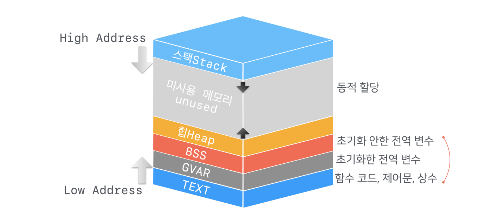

### 일반적인 운영체제 프로세스 메모리 할당 및 동작 방식

- 텍스트 혹은 코드 섹션(Text / Code Section):
  - 프로그램의 실행 코드가 저장됩니다.
  - 실행 파일에서 읽기 전용으로 메모리에 로드됩니다.
  - 함수와 실행 명령어가 포함됩니다.
- 데이터 섹션(Data Section):
  - 전역 변수와 정적 변수가 저장됩니다.
  - 초기화된 데이터와 초기화되지 않은 데이터로 나뉩니다.
- 힙(Heap):
  - 동적 메모리 할당이 이루어지는 구역입니다.
  - 프로세스 실행 중 필요에 따라 메모리가 할당되고 해제됩니다.
  - 메모리 할당 함수(malloc, calloc, free 등)를 통해 사용됩니다.
- 스택(Stack):
  - 함수 호출과 관련된 지역 변수, 매개 변수, 반환 주소가 저장됩니다.
  - 함수 호출 시 스택 프레임이 생성되고, 함수가 종료되면 스택 프레임이 제거됩니다.
- 위 그림에서 볼 수 있듯, 힙과 스택은 공통의 여유 공간을 사용합니다.
  - 스택은 아래 방향으로 자라고, 힙은 위로 자란다는 식으로 기억

### NodeJS 프로세스 메모리 관리 방식
- V8엔진
  Javascript를 브라우저에서 돌려주는 엔진으로, Javascript를 assembly code로 컴파일해줍니다. 
  NodeJS는 V8엔진을 C++로 wrapping해서 OS가 이해할 수 있게 해주는 자바스크립트 런타임(실행환경)입니다.
- V8 엔진은 메모리를 3개 섹션으로 구분합니다.
  - code, stack, heap
- NodeJS 가비지 콜렉션 Garbage Collection
  - NodeJS에서 원시값은 스택에, 참조 값은 힙에 저장된다.
  - 이때 root 객체로부터 더이상 연결되지 않는 객체가 생기면, 이는 더이상 사용되지 않는 죽은 객체가 되어 가비지 콜랙션의 대상이 된다.
  - NodeJS V8 엔진 가비지 콜랙션은 자동으로 이루어진다.
  1. {: width="150" height="200"} 
  2. {: width="150" height="200"}
  3. {: width="150" height="200"}
  - 위 그림과 같이 root 객체에서 참조 연결이 끊어진 M 객체는 가비지 컬렉션이 작동하여 삭제된다.
  - 언어가 단순화되고, 메모리 누수 문제를 해결할 수 있지만,
  - 반대로 메모리 제어권이 없어져 섬세한 메모리 관리가 불가능해진다.
  - 또한, 가비지 콜렉션은 프로그램을 잠시 멈추게 하며, 이외에도 결국 컴퓨팅 자원을 사용한다는 단점이 있다.
- 콜렉터 동작 방식
  - 너무 복잡해서 따로 추가로 정리할 예정..

### 힙 메모리 단편화fragmentation 해결책 
- 내부 단편화: 메모리를 할당할 때 프로세스가 필요한 양보다 더 큰 메모리가 할당되어서 프로세스에서 사용하는 메모리 공간이 낭비 되는 현상
- 외부 단편화: 메모리가 할당 및 해제 작업의 반복으로 작은 메모리가 중간중간에 존재 중간중간에 생긴 사용하지 않는 메모리가 존재해서 총 메모리 공간은 충분하지만 실제로 할당할 수 없는 상황
1. Paging 페이징
    
   - 프로세스를 일정 크기로 잘게 쪼개어 순서와 상관없이 적재하는 방식 
   - 단점: 페이지 프레임 단위로 쪼개면서 내부 단편화 문제의 비중이 늘어난다.
2. Segmentation 세그맨테이션
    
   - 고정된 크기 페이징 테이블과 달리 서로 다른 크기의 논리적 단위, 세그먼트Segment로 분할
   - 각각 시작 주소, 세그먼트 크기를 갖는다.
   - 단점: 서로 다른 크기의 세그먼트들이 적재되고 제거되는 일이 반복되다 보면, 작은 조각의 자유 공간들이 많아지면서 외부 단편화 증가
3. Memory pool
    
   - 고정된 크기의 블록을 할당하여 메모리 동적 할당을 가능하게 한다.
   - memory pool이라 불리는 동일한 사이즈의 메모리 블록들을 미리 할당하고 프로세스들이 필요할 때마다 사용하고 반납한다.
   - 할당 해제가 빈번할 때 효과적이다. 외부/외부 단편화는 없다.
   - 미리 할당해 두기 때문에 메모리 누수 memory leak가 있다.

### 리눅스 가상 메모리 현황 확인 방법
- cat /proc/meminfo
  
- top 명령어
- vmstat(virtual memory statistic reporter) 명령어
  
  - Procs: processes
    - r: 실행 중인 프로세스 수
    - b: 중단 없는 수면 상태 프로세스 수
  - Memory
    - swpd: 사용 중인 가상 메모리 사이즈
    - ...
- pmap
  - sudo pmap -x 프로세스ID
  - 해당 프로세스의 메모리 주소 및 사용량을 확인할 수 있습니다.
     
    - RSS: 실제 할당 공간
    - Mapping: 할당 목적

### NodeJS OS 모듈
- 운영체제와 시스템 정보를 가져오는 모듈
- `os.totalmem()` : 시스템의 총 메모리
- `os.freemem()` : 시스템의 가용 메모리
- `os.cpus()` : CPU의 정보를 담은 객체. CPU의 세부 정보를 반환합니다. 코어가 몇개인지. 8코어 16스레드 -> 16코어로 침
- `os.networkInterfaces()` : 네트워크 인터페이스 정보를 담은 배열
- 전체 api는 다음 공식 문서 참조 https://nodejs.org/api/os.html

### + js 테스트 자동화 도구 (테스트 라이브러리)
js에서 여러 클래스 간의 연관 관계가 복잡한 프로젝트를 수행할 때, 단위 테스트를 위한 라이브러리가 필요하다는 생각이 들어 조사했습니다.
- 브라우저 환경
  - Karma
- NodeJS 환경
  - Mocha, Jest, Puppeteer
  - Puppeteer는 크롬 api로 브라우저 테스트도 진행 가능
---
제공하는 기능에 따라서 다음과 같이 나뉘기도 합니다.
- Test Runner
- Testing Framework
- Assertion Library
- Test Double Library