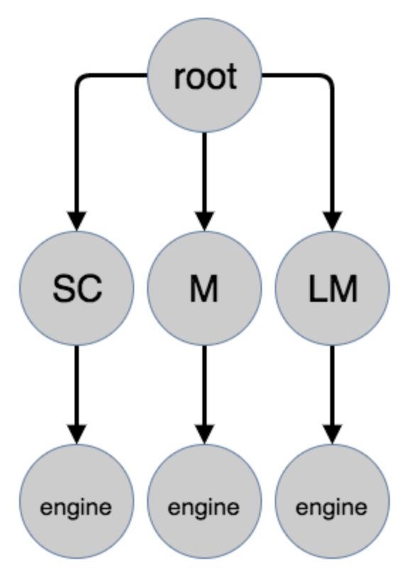
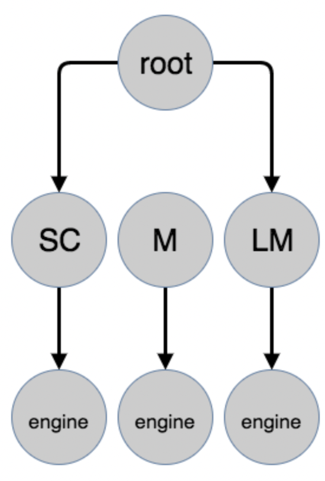
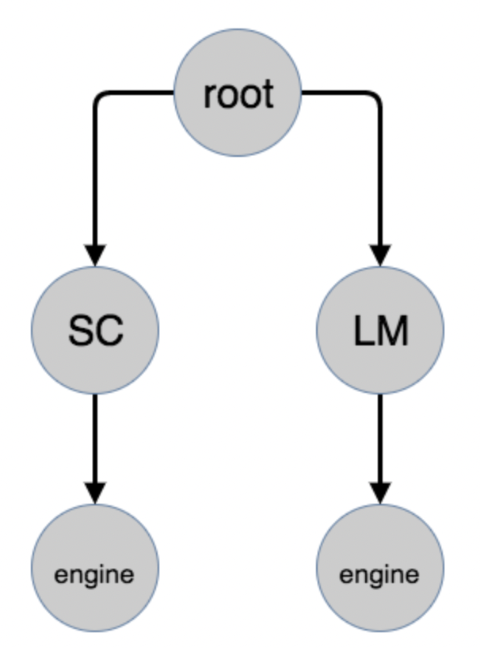
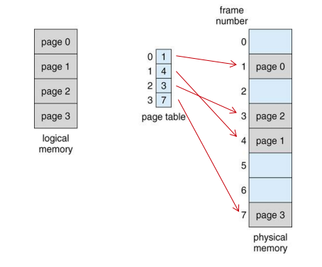
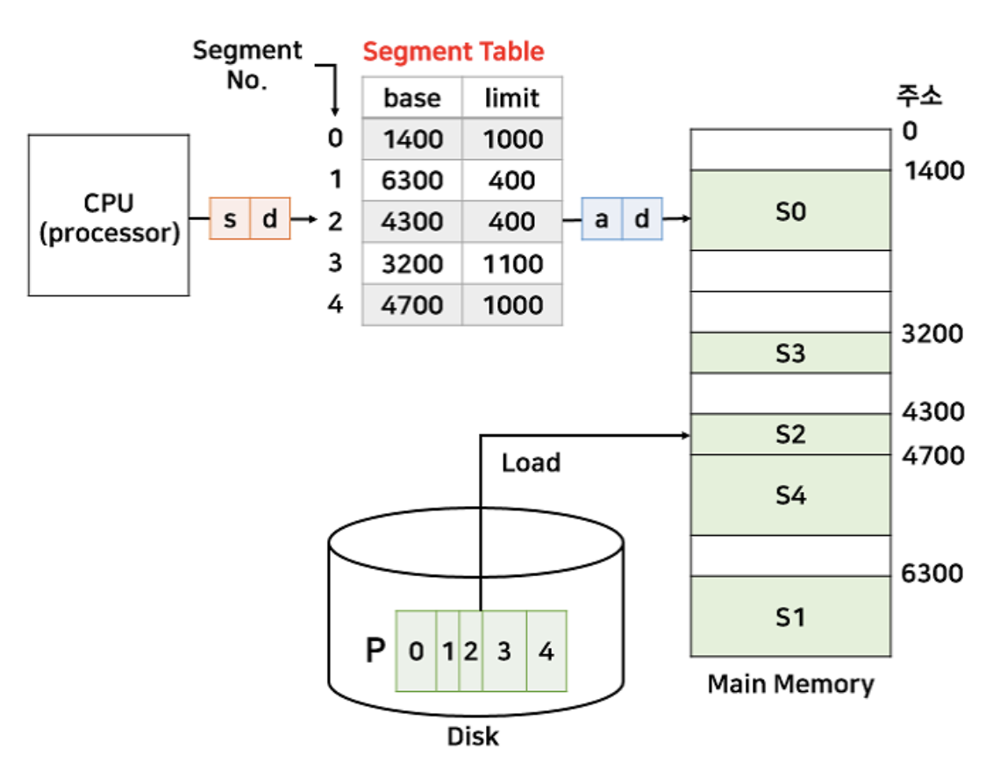
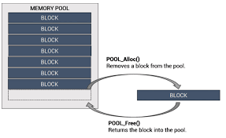
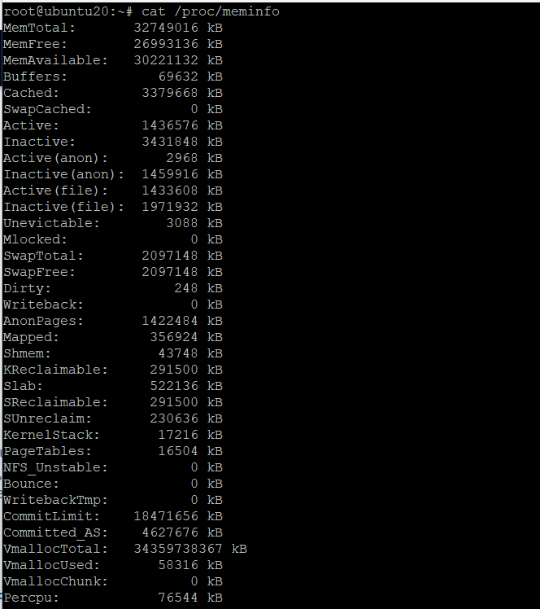
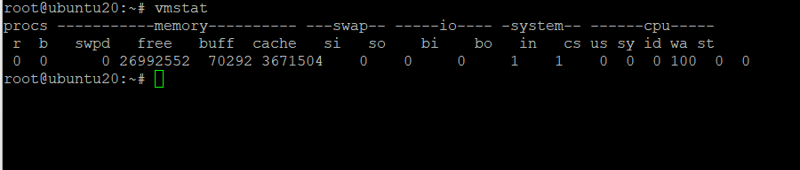
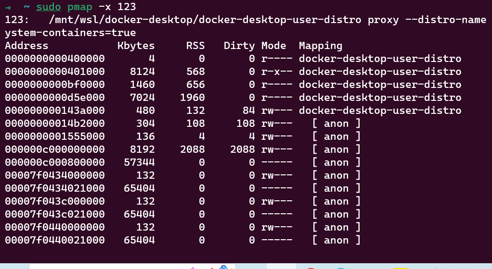

<!-- @import "[TOC]" {cmd="toc" depthFrom=1 depthTo=6 orderedList=false} -->

<!-- code_chunk_output -->

- [CS:APP 가상 주소 (c언어 프로그램 기준)](#csapp-가상-주소-c언어-프로그램-기준)
  - [Program and data - (7. Linking)](#program-and-data---7-linking)
  - [Heap - (9. Virtual Memory)](#heap---9-virtual-memory)
  - [Shared libraries - (7.10 Dynamic Linking with Shared Libraries)](#shared-libraries---710-dynamic-linking-with-shared-libraries)
  - [Stack - (3. Machine-Level Representation of Programs)](#stack---3-machine-level-representation-of-programs)
  - [Kernel virtual memory](#kernel-virtual-memory)
  - [동작 - 9장](#동작---9장)
- [NodeJS 프로세스 메모리 관리 방식](#nodejs-프로세스-메모리-관리-방식)
  - [V8엔진](#v8엔진)
  - [NodeJS 힙 공간](#nodejs-힙-공간)
  - [NodeJS 가비지 콜렉션](#nodejs-가비지-콜렉션)
- [힙 메모리 단편화fragmentation 해결책](#힙-메모리-단편화fragmentation-해결책)
  - [리눅스 가상 메모리 현황 확인 방법](#리눅스-가상-메모리-현황-확인-방법)
- [NodeJS Process/OS 모듈](#nodejs-processos-모듈)
  - [Process 모듈](#process-모듈)
  - [OS 모듈](#os-모듈)
- [+ js 테스트 자동화 도구 (테스트 라이브러리)](#-js-테스트-자동화-도구-테스트-라이브러리)
- [NodeJS에서 TDD 이루기](#nodejs에서-tdd-이루기)

<!-- /code_chunk_output -->

## CS:APP 가상 주소 (c언어 프로그램 기준)


**가상 메모리**란 결국 추상화 개념입니다.
이는 각 프로세스가 메인 메모리를 배타적으로 사용하는 것처럼 보이게 합니다.
각 프로세스는 **가상 주소 공간**이라는 동일한 형태의 메모리를 갖습니다. 리눅스 프로세스의 가상 주소 공간은 위 그림과 같습니다.

- 각각 특별한 목적을 가진 여러 영역들로 구성됩니다.

- 리눅스에서 주소 공간의 최상위 영역(그림에서 가장 아래 Read-only code and data, 주소는 아래에서 위로 증가): 모든 프로세스에 공통으로 사용되는 운영 체제의 코드와 데이터가 할당됩니다.

- 바로 아래 Read/write data: 사용자의 프로세스에 의해 정의된 코드와 데이터를 포함합니다.

### Program and data - (7. Linking)

### Heap - (9. Virtual Memory)

### Shared libraries - (7.10 Dynamic Linking with Shared Libraries)

### Stack - (3. Machine-Level Representation of Programs)

### Kernel virtual memory

최상위 영역은 커널을 위해 할당됩니다. 응용 프로그램은 이 영역의 내용에 읽기/쓰기가 불가합니다. 또한, 이 영역의 커널 코드에 정의된 함수도 부를 수 없습니다. 응용 프로그램에서 이러한 작업을 수행하려면 커널을 호출해야만 합니다.

### 동작 - 9장

가상 메모리가 작동하려면, 하드웨어와 운영 체제 소프트웨어 간의 정교한 상호작용이 필요합니다. 여기에는 프로세서가 생성한 모든 주소의 하드웨어 변환이 포함됩니다. 관련된 기본적인 아이디어는 프로세스의 가상 메모리 내용을 디스크에 저장한 다음, 메인 메모리를 디스크의 캐시로 사용하는 것입니다. 9장은 이것이 어떻게 작동하는지와 현대 시스템의 운영에 왜 중요한지 설명합니다.

=> 3장과 9장을 읽어보자.

## NodeJS 프로세스 메모리 관리 방식

### V8엔진

Javascript를 브라우저에서 돌려주는 엔진으로, Javascript를 assembly code로 컴파일해줍니다.
NodeJS는 V8엔진을 C++로 wrapping해서 OS가 이해할 수 있게 해주는 자바스크립트 런타임(실행환경)입니다.

- V8 엔진은 메모리를 3개 섹션으로 구분합니다.
  - code, stack, heap
- NodeJS 어플리케이션이 시작되면, 다음과 같은 워크플로우를 따릅니다.
  - V8이 힙을 할당해 줍니다.
  - 어플리케이션이 힙을 채웁니다.
  - V8 가비지 콜렉션이 작동해 힙을 청소합니다.
  - 만약 힙이 가득차면 V8이 힙의 크기를 늘립니다.

### NodeJS 힙 공간

- 크게 두개의 공간으로 분할됩니다. (더 많은 공간 분할이 일어나지만, 우선 아래 2개 공간에 집중합니다.)

1. Old space
   - 오래된 객체가 저장되어 있습니다. 대체로 아래 *New space*에서 몇 차례 살아남은 객체들이 이곳으로 옮겨집니다. 이 *old space*는 command line api `node --max-old-space-size`로 제어할 수 있습니다.
2. New space
   - 대부분의 객체가 이곳에 할당됩니다.
   - new space는 가비지 콜렉션 사이클을 한 번 살아남은 객체부터 방금 막 할당된 객체의 공간으로 나뉩니다.
   - new space로의 할당은 비용이 적지만, 1~8MB의 작은 사이즈로 되어 있습니다. 따라서, 새로운 객체가 old space에 할당되는 것을 막기 위해 가능한 빨리 객체를 없애 메모리를 비우는 것이 좋습니다.

### NodeJS 가비지 콜렉션

- NodeJS에서 원시값은 스택에, 참조 값은 힙에 저장된다.
- 이때 root 객체로부터 더이상 연결되지 않는 객체가 생기면, 이는 더이상 사용되지 않는 죽은 객체가 되어 가비지 콜랙션의 대상이 된다.
- NodeJS V8 엔진 가비지 콜랙션은 자동으로 이루어진다.

1. {: width="150" height="200"}
2. {: width="150" height="200"}
3. {: width="150" height="200"}

- 위 그림과 같이 root 객체에서 참조 연결이 끊어진 M 객체는 가비지 컬렉션이 작동하여 삭제된다.
- 언어가 단순화되고, 메모리 누수 문제를 해결할 수 있지만,
- 반대로 메모리 제어권이 없어져 섬세한 메모리 관리가 불가능해진다.
- 또한, 가비지 콜렉션은 프로그램을 잠시 멈추게 하며, 이외에도 결국 컴퓨팅 자원을 사용한다는 단점이 있다.
- 콜렉터 동작 방식
  - 너무 복잡해서 따로 추가로 정리할 예정..

## 힙 메모리 단편화fragmentation 해결책

- 내부 단편화: 메모리를 할당할 때 프로세스가 필요한 양보다 더 큰 메모리가 할당되어서 프로세스에서 사용하는 메모리 공간이 낭비 되는 현상
- 외부 단편화: 메모리가 할당 및 해제 작업의 반복으로 작은 메모리가 중간중간에 존재 중간중간에 생긴 사용하지 않는 메모리가 존재해서 총 메모리 공간은 충분하지만 실제로 할당할 수 없는 상황

1. Paging 페이징
   
   - 프로세스를 일정 크기로 잘게 쪼개어 순서와 상관없이 적재하는 방식
   - 단점: 페이지 프레임 단위로 쪼개면서 내부 단편화 문제의 비중이 늘어난다.
2. Segmentation 세그맨테이션
   
   - 고정된 크기 페이징 테이블과 달리 서로 다른 크기의 논리적 단위, 세그먼트Segment로 분할
   - 각각 시작 주소, 세그먼트 크기를 갖는다.
   - 단점: 서로 다른 크기의 세그먼트들이 적재되고 제거되는 일이 반복되다 보면, 작은 조각의 자유 공간들이 많아지면서 외부 단편화 증가
3. Memory pool
   
   - 고정된 크기의 블록을 할당하여 메모리 동적 할당을 가능하게 한다.
   - memory pool이라 불리는 동일한 사이즈의 메모리 블록들을 미리 할당하고 프로세스들이 필요할 때마다 사용하고 반납한다.
   - 할당 해제가 빈번할 때 효과적이다. 외부/외부 단편화는 없다.
   - 미리 할당해 두기 때문에 메모리 누수 memory leak가 있다.

### 리눅스 가상 메모리 현황 확인 방법

- cat /proc/meminfo
  
- top 명령어
- vmstat(virtual memory statistic reporter) 명령어
  
  - Procs: processes
    - r: 실행 중인 프로세스 수
    - b: 중단 없는 수면 상태 프로세스 수
  - Memory
    - swpd: 사용 중인 가상 메모리 사이즈
    - ...
- pmap
  - sudo pmap -x 프로세스ID
  - 해당 프로세스의 메모리 주소 및 사용량을 확인할 수 있습니다.
    
    - RSS: 실제 할당 공간
    - Mapping: 할당 목적

## NodeJS Process/OS 모듈

### Process 모듈

현재 NodeJS 프로세스에 관한 정보와 제어를 제공합니다. `process`는 이벤트 리스너를 등록하고 이벤트를 발생시키는 `EventEmitter` 클래스의 인스턴스입니다.
[공식 문서 전체 api](https://nodejs.org/api/process.html)

- process.constrainedMemory(), availableMemory()
  - 각각 프로세스가 처음 할당 받은 메모리 양, 현재 가용한 free 메모리 양을 바이트 단위로 반환합니다.
- process.cpuUsage
  - user, system CPU 시간 사용량을 반환합니다. 다수 코어가 있다면 실제 경과 시간보다 크게 측정됩니다. 이전 결과 값을 인자로 넘겨 차이를 구할 수 있습니다.
- process.dlopen()
  - shared 객체를 동적으로 로딩할 수 있게 합니다.
  - c++ 애드온을 로드하기 위한 require()문에서 사용됩니다.
- process.memoryUsage()
  메모리 사용량 정보를 담은 객체를 반환합니다.

  ```js
  const { memoryUsage } = require("node:process");

  console.log(memoryUsage());
  // Prints:
  // {
  //  rss: 4935680,
  //  heapTotal: 1826816,
  //  heapUsed: 650472,
  //  external: 49879,
  //  arrayBuffers: 9386
  // }
  ```

  - `rss`: Resident Set Size, C++, JS 객체와 코드를 모두 포함해 프로세스가 차지하는 메인 메모리 공간
  - `heap`: V8 엔진의 메모리 사용량
  - `external`: V8이 관리하는 JS 객체에 바인딩된 C++ 객체의 메모리 사용량
  - `arrayBuffers`: `ArrayBuffer`, `SharedArrayBuffer에` 할당된 메모리로, NodeJS의 Buffer 또한 포함합니다. `external에도` 포함되어 있으며, NodeJS가 임베딩된 라이브러리인 경우 `arrayBuffers` 값은 추적되지 않아 0이 됩니다.

- **process.nextTick(callback[, ...args])**

  - 다음 tick queue에 콜백을 추가합니다. 이 큐는 JS 스택의 연산이 전부 수행되고 event loop가 계속되도록 허용되기 전에 완전히 비워집니다.
  - 재귀적으로 호출되면 무한 루프를 만들 수 있습니다.
  - API를 제작할 때 사용자가 이벤트 핸들러를 객체 생성 이후, I/O 발생 이전에 적용할 수 있게 한다는 점에서 중요합니다.

    ```js
    const { nextTick } = require("node:process");

    function MyThing(options) {
      this.setupOptions(options);

      nextTick(() => {
        this.startDoingStuff();
      });
    }

    const thing = new MyThing();
    thing.getReadyForStuff();
    // thing.startDoingStuff()은 다음 틱인 정확히 이 시점에 호출됩니다.
    ```

    어떠한 API가 완전한 동기 혹은, 완전한 비동기로 구현되도록 하는것은 매우 중요합니다. 다음 상황을 봅시다.

    ```js
    const maybeTrue = Math.random() > 0.5;

    maybeSync(maybeTrue, () => {
      foo();
    });

    bar();
    ```

    ```js
    function maybeSync(arg, cb) {
      if (arg) {
        cb(); // 해결책: nextTick(cb);
        return;
      }

      fs.stat("file", cb);
    }
    ```

    위 상황에서, maybeTrue가 true라면 콜백 함수로 전달되 foo()가 먼저 실행되지만, false일 때는 fs.stat()이 비동기 함수이므로 bar()이 먼저 실행되고 마칩니다.
    **이를 해결하기 위해 nextTick(cb)를 적용해 항상 bar()이 먼저 실행되게 합니다.**

- process.stdin, process.stdout
  - stdin/stdout과 연결된 stream을 반환합니다. 파일을 참조하지 않는다면 이는 읽기 쓰기가 모두 가능한 duplex Stream인 net.Socket()입니다.
  - cf. net.Socket 클래스
    - TCP socket 혹은 streaming IPC endpoint의 추상화입니다. 이 역시 EventEmitter입니다. 사용자가 서버와 직접 상호작용하기 위해 만들고 사용할 수 있습니다. 한 예로, `net.createConnection()`이 net.Socket을 반환하여 사용자가 서버와 대화할 수 있게 됩니다.
    - NodeJS가 생성하고 사용자에게 전달하기도 합니다. net.Server의 connection 이벤트가 발생했을 때 이벤트리스너에 전달됩니다.
- process.message, channel, connected, ..
  - NodeJS 프로세스가 IPC(inter process communication 프로세스간 통신) 채널에서 생성되었을 때 사용됩니다.

### OS 모듈

운영체제와 시스템 정보를 가져오는 모듈로, 호스트 컴퓨터의 cpu나 메모리, 디스크 용량 등을 확인합니다.

- `os.totalmem()` : 시스템의 총 메모리
- `os.freemem()` : 시스템의 가용 메모리
- `os.cpus()` : CPU의 정보를 담은 객체. CPU의 세부 정보를 반환합니다. 코어가 몇개인지. 8코어 16스레드 -> 16코어로 침
- `os.networkInterfaces()` : 네트워크 인터페이스 정보를 담은 배열
  [공식 문서 전체 api](https://nodejs.org/api/os.html)

## + js 테스트 자동화 도구 (테스트 라이브러리)

js에서 여러 클래스 간의 연관 관계가 복잡한 프로젝트를 수행할 때, 단위 테스트를 위한 라이브러리가 필요하다는 생각이 들어 조사했습니다.

- 브라우저 환경
  - Karma
- NodeJS 환경
  - Mocha, Jest, Puppeteer, Chai
  - Puppeteer는 크롬 api로 브라우저 테스트도 진행 가능

---

제공하는 기능에 따라서 다음과 같이 나뉘기도 합니다.

- Test Runner
- Testing Framework
- Assertion Library
- Test Double Library

## NodeJS에서 TDD 이루기

chai, mocha를 활용한 테스트

- it이 각 테스트를 의미하며, describe가 test suite(테스트 집합, 모음)에 구조를 부여합니다.
- sentactic sugar로서 co-mocha, chia-as-promised까지
- 최종 예시 코드

  ```js
  "use strict";

  const User = require("./User");

  const chai = require("chai");
  const chaiAsPromised = require("chai-as-promised");

  const db = require("./database");

  chai.use(chaiAsPromised);
  const expect = chai.expect;

  describe("User module", () => {
    describe('"up"', () => {
      function cleanUp() {
        return db.schema.dropTableIfExists("users");
      }

      before(cleanUp);
      after(cleanUp);

      it("should export a function", () => {
        expect(User.up).to.be.a("Function");
      });

      it("should return a Promise", () => {
        const usersUpResult = User.up();
        expect(usersUpResult.then).to.be.a("Function");
        expect(usersUpResult.catch).to.be.a("Function");
      });

      it('should create a table named "users"', function* () {
        yield User.up();
        return expect(db.schema.hasTable("users")).to.eventually.be.true;
      });

      /** Before semantic sugar
       it('should create a table named "users"', () => {
        return User.up()
          .then(() => db.schema.hasTable('users'))
          .then((hasUsersTable) => expect(hasUsersTable).to.be.true)
      })
      */
    });
  });
  ```

  yield: co-mocha에서 프로미스를 멈추게 함. 실행 다 될 때까지 기다림.
  evantually: chai-as-promised에서 chai 컴포넌트를 프로미스에 대한 기댓값으로 확장해 줌.

  ```js
  describe("fetch", () => {
    it("should export a function", () => {
      it("should export a function", () => {
        expect(User.fetch).to.be.a("Function");
      });
      it("should return a Promise", () => {
        const usersFetchResult = User.fetch();
        expect(usersFetchResult.then).to.be.a("Function");
        expect(usersFetchResult.catch).to.be.a("Function");
      });

      describe("with inserted rows", () => {
        const testName = "Peter";

        before(() => User.up());
        beforeEach(() =>
          Promise.all([
            db
              .insert({
                name: testName
              })
              .into("users"),
            db
              .insert({
                name: "John"
              })
              .into("users")
          ])
        );

        it("should return the users by their name", () =>
          expect(
            User.fetch(testName).then(
              _.map(_.omit(["id", "created_at", "updated_at"]))
            )
          ).to.eventually.be.eql([
            {
              name: "Peter"
            }
          ]));
      });
    });
  });
  ```

  - 위의 테이블 생성 이후 fetch 함수 테스트 코드
  - before로 테이블 생성, beforeEach로 테이블에 데이터 넣음.
  - lodash를 활용하지 않은 코드는 아래와 같음.
    ```js
    it("should return users with timestamps and id", () =>
      expect(
        User.fetch(testName).then((users) => users[0])
      ).to.eventually.have.keys("created_at", "updated_at", "id", "name"));
    ```
  - internal function 테스트 (with `sinon` 모듈)

    - external function 호출에 대한 무시가 필요한데, sinon 모듈로 아래와 같이 가능합니다.
    - stubbing: 함수의 구현을 제공하여 호출되지 않습니다.
    - spying: 원본 구현과 함께 호출되지만 assertion을 만들 수 있습니다.
    - mocking: stubbing과 같으나 객체까지

    ```js
    it("should call winston if name is all lowercase", function* () {
      sinon.spy(logger, "info");
      yield User.fetch(testName.toLocaleLowerCase());

      expect(logger.info).to.have.been.calledWith(
        "lowercase parameter supplied"
      );
      logger.info.restore();
    });
    ```

    ```js
    function fetch(name) {
      if (name === name.toLocaleLowerCase()) {
        logger.info("lowercase parameter supplied");
      }

      return db.select("*").from("users").where({ name });
    }
    ```

    결과

    ```
    with inserted rows
    info: lowercase parameter supplied
        ✓ should return users with timestamps and id
    info: lowercase parameter supplied
        ✓ should return the users by their name
    info: lowercase parameter supplied
        ✓ should call winston if name is all lowercase
    ```

- [Getting Node.js Testing and TDD Right](https://blog.risingstack.com/getting-node-js-testing-and-tdd-right-node-js-at-scale/)
