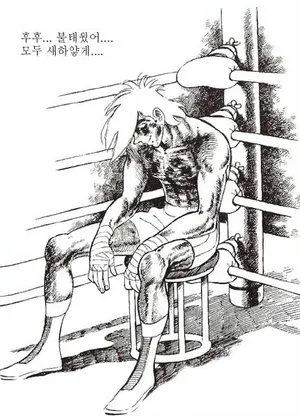

주차마다 회고를 작성할 예정인데, 하나의 블로그에 정리해서 스스로를 돌아보고자 합니다.
KPT 방법론을 기반으로 다양한 내용을 작성해 보겠습니다.
참여 중인 캠퍼 분이라면 함께 남은 일정들도 이겨내보아요..ㅎㅎ

<!-- @import "[TOC]" {cmd="toc" depthFrom=1 depthTo=6 orderedList=false} -->

<!-- code_chunk_output -->

- [1주차](#1주차)
- [2주차](#2주차)
- [3주차](#3주차)
- [4주차](#4주차)

<!-- /code_chunk_output -->

## 1주차

**💡 KEEP (지속할 것)**

- 문제 해결 과정에 대한 몰입을 이룬다.
- 나의 상태를 파악하고 필요한 휴식을 취한다.
  - 숏츠, 릴스, SNS ❌
  - 독서, 명상, 파워냅, 산책 등 도움이 되는 휴식 ⭕️

**💡 PROBLEM (문제가 되는 것)**

- P1. 구현과 학습의 균형을 잡지 못하였다. **&rarr; 2주차 개선**
- P2. 문제 해결에만 집중하여 커뮤니티에 기여하지 못하였다.
- P3. 프로그램 이해가 아닌 산출물만을 위한 요구사항 분석, 설계 과정이 있었다. **&rarr; 2주차 개선**
- P4. 학습 정리의 가독성이 좋지 않다. **&rarr; 2주차 개선**

**💡 TRY (문제에 대응해 시도할 것)**

- S1. 학습 및 각 문제 해결 과정에 마감 기한을 정해둔다.
- S2. ~~몰골이 괜찮으면~~ 줌 라운지 회의실에 들어가서 작업한다.
  - 흥미로운 주제/자료를 찾으면 당일에 슬랙에서 공유한다.
  - 피어 세션 시간이 부족하다는 것은 핑계, 다른 시간에라도 동료의 코드를 읽어보고 정리해 본다.
- S3. 형식에 집착하지 말고, 손으로 그려보며 동작 흐름을 이해하고 설계를 대비한다.
  - 설계 과정을 위해, 요구사항을 만족하는 조건을 따져본다.
- S4. 아침 시간이 짧으니 코드를 전부 읽을 시간은 적다. 나 역시 피어 세션에 도움을 받기 위해서는 TL;DR 버전(구현 설명)을 추가한다.

베이직에 비해 매우 어려운 난이도에 첫 날부터 방심했고, 하루하루 많은 어려움을 겪었던 것 같습니다. 그럼에도 내가 잘하는 것과 못하는 것을 알아볼 수 있었고 멋진 동료 분들 덕분에 힘을 내고 고쳐나갈 수 있었습니다.

전공 강의에서 배웠지만 잊고 있던 지식들을 복습하고 직접 만들어보며 학습하니 새로운 이해가 생겼습니다. 무엇보다 즐거웠습니다.

수료생 MeetUp 시간에 들었던 것처럼, 이렇게 멋진 개발자 커뮤니티에서 소통하고 함께 몰입할 기회가 생긴 것에 감사함을 느낍니다. 첫 주차가 아주 만족스럽지는 않았지만, 나름대로 잘 헤쳐나가고 있는 것 같습니다. 남은 주차 동안 위 회고와 같이 스스로를 점검하며 누구보다 멋지게 성장하고 싶습니다.

부스트캠프 여러분 모두 3주간 같이 화이팅 해봐요 ㅎㅎ

## 2주차

**💡 KEEP (지속할 것)**

- 문제 해결 과정에 대한 몰입을 이룬다.
- 나의 상태를 파악하고 필요한 휴식을 취한다.
  - 숏츠, 릴스, SNS ❌
  - 독서, 명상, 파워냅, 산책 등 도움이 되는 휴식 ⭕️
- 학습 및 각 문제 해결 과정에 마감 기한을 정해둔다.

**💡 PROBLEM (문제가 되는 것)**

- P1. 문제 해결에만 집중하여 커뮤니티에 기여하지 못하였다. 줌 라운지 혹은 우리 팀의 회의실은 자주 참여하였다. 다만, 단체 카톡방에서도 말을 별로 하지 않는 나에게 여전히 슬랙은 어렵다.. 심지어 의문점이 생겼을 때 찾아보면 이미 관련 논의가 슬랙에 있어 공감 표시를 누르고 나오는 것 같다.
- P2. 문제 해결을 위한 학습과 학습 정리를 별개로 진행하고 있다.
- P3. 협업 중 의사 결정에 기준이 부족하다.

**💡 TRY (문제에 대응해 시도할 것)**

- S1. 좋은 자료와 의문점은 빠르게 공유하자. 스스로 성장하고 커뮤니티에 좋은 영향을 주는 개발자!
- S2. 급하다 하더라도 정해진 학습 시간에는 간단한 정리를 통한 이해 확인을 함께한다.
- S3. 협업을 하게 된다면 본격적인 작업 시작 이전에, 문제 해결 성향을 나누고 의사 결정의 기준을 정한다.
  - 목표와 세부적인 목표, 추구하는 가치를 정한다 (ex. 빠른 해결, 현실과 밀접한 결과물, 코드 품질, ...)

벌써 부스트캠프 챌린지의 2주차가 지나갔네요. 너무 어려워 머리를 싸맨 날도 있었지만, 원활히 진행한 미션도 있었고 분명 1주차에 비해 챌린지라는 멋진 환경에 적응해낸 것 같습니다. 함께 이 길을 가고 있는 동료들이 있고, 주말에는 부족한 잠을 보충하며 1주간의 스프린트를 갈무리할 수 있다는 점이 위로가 됩니다. 다만 방심하지 않으려 합니다. 다양한 협업 미션에서 잘 들어주면서도 활발한 소통을 이루려 하지만, 의사 결정이나 손발을 맞추는 일은 어려운 것 같습니다. 앞으로도 많은 협업이 예정되어 있는 것 같은데, 긴장을 가지면서도 침착하게 나아가야 할 것 같습니다.

하루하루 다루는 내용이, 다른 교육 기관에서는 몇 주에서 한 학기 동안 배우는 것도 있으니, 전부 내 것으로 만드는 것은 사실상 불가능할지도 모르겠네요. 그럼에도 불구하고 빠른 호흡에 내가 부족한 점을 찾고 문제를 해결하기 위해 필요한 점을 빠르게 학습하는 연습이 되는 것 같습니다. 기록해둔 부족한 점들은 주말을 활용해 채우고 있습니다.

벌써 절반이 지나가고, 이렇게 시간이 빠르게 간다면 남은 2주도 금방일 것 같네요. 누가 찾아와서 보고 계실지 모르지만, 부스트캠프 구성원 여러분 모두 화이팅해봐요 :)

## 3주차

## 4주차
