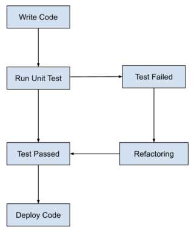

<!-- @import "[TOC]" {cmd="toc" depthFrom=1 depthTo=6 orderedList=false} -->

<!-- code_chunk_output -->

- [TDD](#tdd)
- [JS 테스트 자동화 도구 (테스트 라이브러리)](#js-테스트-자동화-도구-테스트-라이브러리)
- [NodeJS에서 TDD 이루기](#nodejs에서-tdd-이루기)

<!-- /code_chunk_output -->

## TDD

TDD(Test Driven Development: 테스트 주도 개발)는 실제 **코드 작성 전**에, 단위 테스트 케이스를 만드는 것에 초점을 둔 개발 방법론입니다. 애자일 개발 방법론의 하나로, 단위 테스트 생성, 개발, 그리고 리팩토링의 주기를 반복합니다. 디음과 같은 3개의 주기로 나누기도 합니다.

1. Red: 실패하는 테스트 작성
2. Green: 테스트를 통과하게 하는 최소한의 코드 작성
3. Refactor: 코드를 리팩토링하여 개선

- 아래 그림과 같이 표현될 수 있습니다.
  

TDD는 전통적인 테스팅과 달리, 테스트를 코드 작성 전에 먼저 작성합니다. 이는 개발 프로세스에서 버그(에러)를 가능한 빨리 발견하게 하여 디버깅 및 수정을 용이하게 합니다.

추가로, 소프트웨어의 동작(Behavior)에 초점을 둔 BDD도 있습니다. 이는 사용자, 개발자, 비즈니스 이해 관계자가 정의한 시나리오를 기반으로 테스트 작성 및 개발 작업이 진행됩니다.

TDD가 반드시 도입해야 할 방법론은 아닙니다. 결국 추가적인 작업이며 자원 소모입니다. 장단점을 잘 확인해서 도입할 필요가 있습니다.

## JS 테스트 자동화 도구 (테스트 라이브러리)

js에서 여러 클래스 간의 연관 관계가 복잡한 프로젝트를 수행할 때, 단위 테스트를 위한 라이브러리가 필요하다는 생각이 들어 조사했습니다.

- 브라우저 환경
  - Karma
- NodeJS 환경
  - Mocha, Jest, Puppeteer, Chai, Jasmine
  - Puppeteer는 크롬 api로 브라우저 테스트도 진행 가능

제공하는 기능에 따라서 다음과 같이 나뉘기도 합니다.

- Testing Framework: Mocha, Jest, Jasmine
- Assertion Library: Chai, Assert(NodeJS 빌트인)
- Test Double Library: Sinon, TestDouble

기업에 소속된 상태가 아니라면, 어떤 프레임워크를 사용할지가 가장 고민일 것입니다.
[BrowserStack](https://www.browserstack.com/guide/jest-vs-mocha-vs-jasmine)에서 이야기하는 각 프레임워크의 특징 및 장단점을 번역해 보았습니다:

| **특징**                 | **Jest**                                                 | **Mocha**                                                                            | **Jasmine**                                                                                  |
| ------------------------ | -------------------------------------------------------- | ------------------------------------------------------------------------------------ | -------------------------------------------------------------------------------------------- |
| **주요 사용 환경**       | React를 위해 처음 개발되어, NextJS와도 잘 작동합니다.    | NodeJS로 설계된 애플리케이션에 더 적합합니다.                                        | AngularJS와 잘 작동합니다.                                                                   |
| **적합한 애플리케이션**  | 강력한 UI 기반 애플리케이션에 적합합니다.                | 복잡한 백엔드 애플리케이션에 적합합니다.                                             | 가볍고 단순한 프로젝트에 적합합니다.                                                         |
| **내장 기능**            | 내장된 assertion 라이브러리와 자동 모킹 기능이 있습니다. | 내장된 assertion 라이브러리는 없습니다. Chai 같은 외부 라이브러리를 주로 사용합니다. | 내장된 assertion 라이브러리가 있습니다.                                                      |
| **모킹 기능**            | 자동 모킹 기능이 Jest 패키지에 포함되어 있습니다.        | 모킹 기능은 내장되어 있지 않습니다. Simon을 사용하여 모킹할 수 있습니다.             | 모킹 기능이 Jasmine 프레임워크에 포함되어 있습니다.                                          |
| **테스트 러너**          | Jest 패키지 내에 테스트 러너가 포함되어 있습니다.        | 테스트 러너가 제공됩니다.                                                            | 기본적으로 테스트 러너가 제공되지 않습니다. Karma와 같은 추가 테스트 러너를 설치해야 합니다. |
| **비동기 테스트**        | 비동기 테스트가 쉽고 좋은 결과를 얻을 수 있습니다.       | 비동기 테스트 성능이 Jest만큼 뛰어나지 않습니다.                                     | 비동기 테스트 성능이 Jest만큼 뛰어나지 않습니다.                                             |
| **지원하는 개발 방법론** | 테스트 주도 개발(TDD)만 지원합니다.                      | 행위 주도 개발(BDD)과 테스트 주도 개발(TDD)을 모두 지원합니다.                       | 주로 행위 주도 개발(BDD)을 지원합니다.                                                       |

## NodeJS에서 TDD 이루기

chai, mocha를 활용한 테스트

- it이 각 테스트를 의미하며, describe가 test suite(테스트 집합, 모음)에 구조를 부여합니다.
- sentactic sugar로서 co-mocha, chia-as-promised까지
- 최종 예시 코드

  ```js
  "use strict";

  const User = require("./User");

  const chai = require("chai");
  const chaiAsPromised = require("chai-as-promised");

  const db = require("./database");

  chai.use(chaiAsPromised);
  const expect = chai.expect;

  describe("User module", () => {
    describe('"up"', () => {
      function cleanUp() {
        return db.schema.dropTableIfExists("users");
      }

      before(cleanUp);
      after(cleanUp);

      it("should export a function", () => {
        expect(User.up).to.be.a("Function");
      });

      it("should return a Promise", () => {
        const usersUpResult = User.up();
        expect(usersUpResult.then).to.be.a("Function");
        expect(usersUpResult.catch).to.be.a("Function");
      });

      it('should create a table named "users"', function* () {
        yield User.up();
        return expect(db.schema.hasTable("users")).to.eventually.be.true;
      });

      /** Before semantic sugar
       it('should create a table named "users"', () => {
        return User.up()
          .then(() => db.schema.hasTable('users'))
          .then((hasUsersTable) => expect(hasUsersTable).to.be.true)
      })
      */
    });
  });
  ```

  yield: co-mocha에서 프로미스를 멈추게 함. 실행 다 될 때까지 기다림.
  evantually: chai-as-promised에서 chai 컴포넌트를 프로미스에 대한 기댓값으로 확장해 줌.

  ```js
  describe("fetch", () => {
    it("should export a function", () => {
      it("should export a function", () => {
        expect(User.fetch).to.be.a("Function");
      });
      it("should return a Promise", () => {
        const usersFetchResult = User.fetch();
        expect(usersFetchResult.then).to.be.a("Function");
        expect(usersFetchResult.catch).to.be.a("Function");
      });

      describe("with inserted rows", () => {
        const testName = "Peter";

        before(() => User.up());
        beforeEach(() =>
          Promise.all([
            db
              .insert({
                name: testName
              })
              .into("users"),
            db
              .insert({
                name: "John"
              })
              .into("users")
          ])
        );

        it("should return the users by their name", () =>
          expect(
            User.fetch(testName).then(
              _.map(_.omit(["id", "created_at", "updated_at"]))
            )
          ).to.eventually.be.eql([
            {
              name: "Peter"
            }
          ]));
      });
    });
  });
  ```

  - 위의 테이블 생성 이후 fetch 함수 테스트 코드
  - before로 테이블 생성, beforeEach로 테이블에 데이터 넣음.
  - lodash를 활용하지 않은 코드는 아래와 같음.
    ```js
    it("should return users with timestamps and id", () =>
      expect(
        User.fetch(testName).then((users) => users[0])
      ).to.eventually.have.keys("created_at", "updated_at", "id", "name"));
    ```
  - internal function 테스트 (with `sinon` 모듈)

    - external function 호출에 대한 무시가 필요한데, sinon 모듈로 아래와 같이 가능합니다.
    - stubbing: 함수의 구현을 제공하여 호출되지 않습니다.
    - spying: 원본 구현과 함께 호출되지만 assertion을 만들 수 있습니다.
    - mocking: stubbing과 같으나 객체까지

    ```js
    it("should call winston if name is all lowercase", function* () {
      sinon.spy(logger, "info");
      yield User.fetch(testName.toLocaleLowerCase());

      expect(logger.info).to.have.been.calledWith(
        "lowercase parameter supplied"
      );
      logger.info.restore();
    });
    ```

    ```js
    function fetch(name) {
      if (name === name.toLocaleLowerCase()) {
        logger.info("lowercase parameter supplied");
      }

      return db.select("*").from("users").where({ name });
    }
    ```

    결과

    ```
    with inserted rows
    info: lowercase parameter supplied
        ✓ should return users with timestamps and id
    info: lowercase parameter supplied
        ✓ should return the users by their name
    info: lowercase parameter supplied
        ✓ should call winston if name is all lowercase
    ```

    이때, logger 호출은 테스트에서 확인할 수 있지만, 실제 output이 매 테스트마다 함께 여러번 출력되고 있습니다.
    테스트 결과가 이와 같이 어수선한 것은 지양해야 하기에 아래와 같이 stub을 활용해 수정할 수 있습니다.
    앞서 말했지만 stub는 함수를 실제로 호출하지 않습니다.

    ```js
    it("should call winston if name is all lowercase", function* () {
      sinon.stub(logger, "info");
      yield User.fetch(testName.toLocaleLowerCase());

      expect(logger.info).to.have.been.calledWith(
        "lowercase parameter supplied"
      );
      logger.info.restore();
    });
    ```

    이러한 패러다임은 여러분의 함수가 DB를 실제로 호출하지 않길 원할 때도 사용할 수 있습니다.
    이때, DB 객체에 대한 함수들을 전부 stub처리하기보다 sinon의 sandbox를 사용하여 테스트의 샌드박스를 정의할 수 있습니다.

    ```js
    it("should build the query properly", function* () {
      const sandbox = sinon.sandbox.create();

      const fakeDb = {
        from: sandbox.spy(function () {
          return this;
        }),
        where: sandbox.spy(function () {
          return Promise.resolve();
        })
      };

      sandbox.stub(db, "select", () => fakeDb);
      sandbox.stub(logger, "info");

      yield User.fetch(testName.toLocaleLowerCase());

      expect(db.select).to.have.been.calledOnce;
      expect(fakeDb.from).to.have.been.calledOnce;
      expect(fakeDb.where).to.have.been.calledOnce;

      sandbox.restore();
    });
    ```

    beforeEach에서 sandbox.create()로 생성하고 afterEach에서 sandbox.restore()로 복원할 수 있습니다.

    ```js
    beforeEach(function () {
      this.sandbox = sinon.sandbox.create();
    });
    afterEach(function () {
      this.sandbox.restore();
    });
    ```

    마지막 리펙토링으로, 가짜 객체에 대한 속성을 계속 stubbing하는 대신 mock을 사용하고, 함수 체이닝 대신 returnThis를 사용할 수 있습니다.

    ```js
    it("should build the query properly", function* () {
      const mock = sinon.mock(db);
      mock.expects("select").once().returnsThis();
      mock.expects("from").once().returnsThis();
      mock.expects("where").once().returns(Promise.resolve());

      yield User.fetch(testName.toLocaleLowerCase());

      mock.verify();
    });
    ```

  - 실패 테스트

    - db 등은 가끔 오류를 일으킬 수 있으며 이에 대한 테스트도 준비해야 합니다. stub으로 에러를 throw해줄 수 있습니다.

    ```js
    it("should log and rethrow database errors", function* () {
      this.sandbox.stub(logger, "error");
      const mock = sinon.mock(db);
      mock.expects("select").once().returnsThis();
      mock.expects("from").once().returnsThis();
      mock
        .expects("where")
        .once()
        .returns(Promise.reject(new Error("database has failed")));

      let err;
      try {
        yield User.fetch(testName.toLocaleLowerCase());
      } catch (ex) {
        err = ex;
      }
      mock.verify();

      expect(logger.error).to.have.been.calledOnce;
      expect(logger.error).to.have.been.calledWith("database has failed");
      expect(err.message).to.be.eql("database has failed");
    });
    ```

    try-catch문을 지양하는 더 함수적인 접근법은 아래와 같습니다.

    ```js
    it("should log and rethrow database errors", function* () {
      this.sandbox.stub(logger, "error");
      const mock = sinon.mock(db);
      mock.expects("select").once().returnsThis();
      mock.expects("from").once().returnsThis();
      mock
        .expects("where")
        .once()
        .returns(Promise.reject(new Error("database has failed")));

      return expect(
        User.fetch(testName.toLocaleLowerCase())
      ).to.be.rejectedWith("database has failed");
    });
    ```

- [Getting Node.js Testing and TDD Right](https://blog.risingstack.com/getting-node-js-testing-and-tdd-right-node-js-at-scale/)
