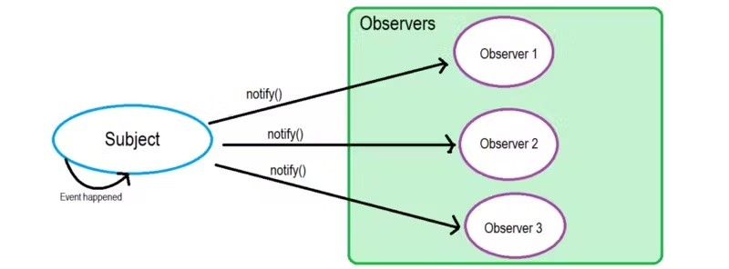
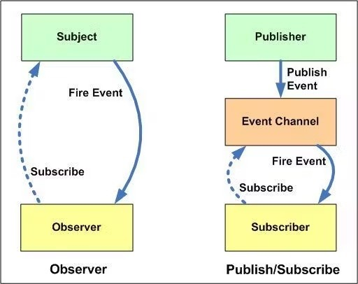
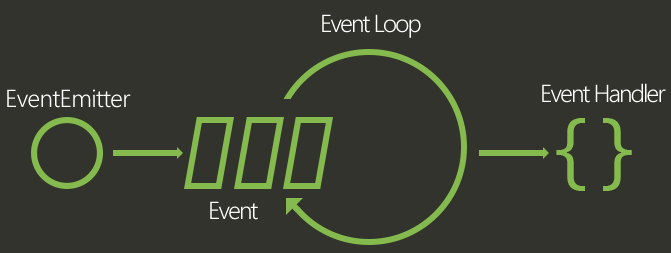

아래 2개 소주제는 다음 포스트 내용을 번역하고 정리하였습니다. [링크드인 포스트 observer vs pubsub](https://www.linkedin.com/pulse/observer-vs-pub-sub-pattern-ahmed-shamim-hassan-s0yrc/)

### Observer Design Pattern

> Subject: 논의, 설명 또는 다루고 있는 사람이나 사물을 의미한다 a person or thing that is being discussed, described, or dealt with.

옵저버 패턴은 subject라 불리는 객체가 그것에 의존하는 observer, 즉 관찰자들에 대한 리스트를 관리하며 만약 어떠한 상태 변화가 일어난다면 자동으로 그들에 고지(주로 그들의 메소드를 호출하여)하는 소프트웨어 디자인 패턴입니다.

위 그림과 같은 동작을 구현한다면 그것은 Observer 디자인 패턴에 따른 것입니다. Observer 패턴의 Subject는 Publisher와 유사하며, Observer는 Subscriber와 유사합니다. Subject가 Observer에 알리듯이 Publisher는 대체로 Subscriber에 알립니다. 따라서 많은 디자인 패턴 책에서 Publisher Subscriber 개념을 Observer 패턴을 설명할 때 이용합니다. 다만, pub-sub 디자인 패턴은 비슷한 듯 다른 점을 가지고 있습니다.

### Pub - Sub Design Pattern

PubSub이 가진 대표적인 차이점은 다음과 같습니다.

- 메시지를 송신하는 이른바 Publisher는 메시지를 직접적으로 특정한 수신자 즉, Subscriber에게 보내지 않습니다.

  - 특정한 조건이 없다면 Publisher와 Subscrisber는 서로의 존재를 모릅니다.

- PubSub에는 Broker라고도 불리는 제3의 구성요소가 있습니다. Event Bus의 메시지 broker 역할을 하며 publisher와 subscriber는 이 요소와 소통합니다. 모든 메시지를 받아들여 필터링하고 적절히 분배해 줍니다.

요약하면 다음과 같습니다.

- Observer 패턴에서 Observer는 Subject를 인식합니를. Subject는 Observer 대한 기록을 유지합니다. 반면, PubSub에서는 Publisher Subscriber가 서로를 알 필요가 없습니다. 이들은 단순히 메시지 큐 또는 브로커 또는 Event Channel (이름은 다양하게 불리곤 합니다) 도움을 받아 통신합니다.
- PubSub 패턴에서는 Observer 패턴과 달리 구성 요소가 느슨하게 결합(loosely coupled)되어 있습니다. Observer 패턴은 대부분 동기식으로 구현되며, 즉 이벤트가 발생하면 Subject가 모가 Observer의 적절한 메서드를 호출합니다. &harr; 반면 PubSub 패턴은 대부분 비동기적으로 구현됩니다(이를 위해 메시지 큐가 사용됩니다).
- Observer 패턴은 단일 애플리케이션의 주소 공간에서 구현되어야 합니다. 반면에 PubSub 패턴은 Cross-Application 패턴과 가깝습니다.

### NodeJS Event Loop

JavaScript는 싱글 스레드 언어라 원래는 한 번에 하나의 작업만 수행이 가능하지만, JS 엔진이 아닌 브라우저의 멀티 스레드인 Web APIs에서 비동기 + 논 블로킹으로 처리됩니다. 이는 메인 스레드가 작업을 다른 곳에 요청하여 대신 실행하고, 그 작업이이 완료되면 이벤트나 콜백 함수로 결과를 받아 실행하는 방식을 말합니다. (NodeJS의 경우 브라우저 대신 libuv 내장 라이브러리가 처리합니다)

이처럼 싱글 스레드인 JS의 작업을 멀티 스레드로 돌려 여러 작업을 동시에 처리하게 하거나, 여러 작업 중 어떤 작업을 우선으로 동작시킬 것인지 결정하기 위한 세심한 처리가 바로 Event Loop 이벤트 루프의 역할입나다. 이벤트 루프는 Main Thread로서 내부의 각 phase를 돌면서 애플리케이션을 실행합니다. 브라우저 내부의 Call Stack, Callback Queue, Web APIs 등 요소를 모니터링하며 비동기적으로 실행되는 작업을 관리하고 순서대로 처리하여 프로그램의 실행 흐름을 제어합니다.

- WebAPIs는 DOM, XMLHttpRequest, Timer API 등이 있는데, 동기와 비동기 처리를 위한 Web API가 모두 존재합니다.
- Callback Queue에는 (macro) task queue와 microtask queue가 있습니다.
  - Task queue: **setTimeout, setInterval, fetch, addEventListener** 와 같이 비동기로 처리되는 함수들의 콜백 함수가 들어갑니다. (macrotask queue를 보통 task queue 라고 부릅니다)
  - Micro task queue: **promise.then, process.nextTick, MutationObserver** 와 같이 우선적으로 비동기로 처리되는 함수들의 콜백 함수가 들어갑니다.
- 콜백 큐의 종류에 따라 이벤트루프가 콜 스택으로 옮기는 순서가 달라집니다. microtask queue가 우선순위가 높은데, 그 안에서도 어떤 작업이냐에 따라 달라질 수 있습니다.
  - Micro task queue는 브라우저 화면 렌더링 보다도 빨리 가장 먼저 콜백이 처리되는데, 그 곳에 프로미스 콜백이 쌓인다는 점을 주목할만 합니다.
    

앞서 잠깐 언급한 바와 같이 NodeJS에서도 브라우저와 유사한 구조를 띄는데, WebAPIs 대신 libuv 라이브러리를 통한 비동기 IO를 사용한다는 점입니다. (WebAPIs를 사용하는 경우도 여전히 있긴 합니다.)

출처: [inpa dev - JS Event Loop 동작 원리](https://inpa.tistory.com/entry/%F0%9F%94%84-%EC%9E%90%EB%B0%94%EC%8A%A4%ED%81%AC%EB%A6%BD%ED%8A%B8-%EC%9D%B4%EB%B2%A4%ED%8A%B8-%EB%A3%A8%ED%94%84-%EA%B5%AC%EC%A1%B0-%EB%8F%99%EC%9E%91-%EC%9B%90%EB%A6%AC) 애니메이션과 함께 다양한 상황의 동작 원리를 사용하여 이해하기 좋습니다. [다음 도구를 사용했다고 하네요.](http://latentflip.com/loupe/?code=JC5vbignYnV0dG9uJywgJ2NsaWNrJywgZnVuY3Rpb24gb25DbGljaygpIHsKICAgIHNldFRpbWVvdXQoZnVuY3Rpb24gdGltZXIoKSB7CiAgICAgICAgY29uc29sZS5sb2coJ1lvdSBjbGlja2VkIHRoZSBidXR0b24hJyk7ICAgIAogICAgfSwgMjAwMCk7Cn0pOwoKY29uc29sZS5sb2coIkhpISIpOwoKc2V0VGltZW91dChmdW5jdGlvbiB0aW1lb3V0KCkgewogICAgY29uc29sZS5sb2coIkNsaWNrIHRoZSBidXR0b24hIik7Cn0sIDUwMDApOwoKY29uc29sZS5sb2coIldlbGNvbWUgdG8gbG91cGUuIik7%21%21%21PGJ1dHRvbj5DbGljayBtZSE8L2J1dHRvbj4%3D)

### Worker Threads

NodeJS가 실행되면 다음 구성요소들이 동작합니다.

- 단일 프로세스: 어디서든 접근 가능한 전역 객체이자 그 순간 실행되고 있는 것들의 정보를 가지고 있는 프로세스 (CS에서 대개 프로그램이 실행 중이면 프로세스라 부릅니다)
- 단일 스레드: 주어진 프로세스에서 오직 한 번에 하나의 명령만이 실행
- 단일 이벤트 루프: 앞의 내용에서 말한 것과 같이, 단일 스레드로 동작하는 JS가 커널에 작업을 offload해 비동기, 비차단 IO를 이루게 함.
- 단일 JS 엔진 인스턴스: js 코드를 실행.
- 단일 NodeJS 인스턴스: 노드js 코드를 실행.

앞 장에서 말했듯 IO 작업은 WebAPIs 혹은 NodeJS 라이브러리로 비동기적으로 효율적으로 동작합니다. 워커 스레드는 CPU 집약 작업의 성능을 높이는 데 사용됩니다.

하나의 프로세스에 여러개의 스레드를 도입하고, 각 스레드마다 이벤트 루프, JS 엔진, NodeJS 인스턴스를 가지게 합니다.

worker_threads 라이브러리를 통해 사용할 수 있습니다.

- 실행 위치
  - 하나의 파일에서 isMainThread를 통해 worker 스레드에서 실행될 코드, 메인 스레드에서 실행될 코드를 나눌 수 있습니다.
  - 모듈화를 통해 워커들을 관리할 수 있습니다.
  - 메인 스레드 &harr; 워커 스레드간 통신은 .postMessage 메소드와 .on 메소드를 통해 이룹니다.
    - 워커 스레드에서 parentPort.on / .postMessage로 부모와 송수신하며,
    - 메인 스레드에서는 worker.on / .postMessage로 통신합니다.
  - 추가로, MessageChannel을 두고 활용할 수 있는데, 이는 Worker 간 데이터 송수신도 가능하게 합니다.
    이때, assert를 사용해 메시지로 넘어온 값이 MessagePort의 인스턴스인지 확인할 필요가 있습니다.
  - Worker를 생성할 때 초기 데이터를 workerData 속성으로 넣어줄 수 있습니다.
  - 여러개의 Worker 스레드를 이터러블 자료형(Set 등)으로 구성할 수 있습니다.

### Event Emitter

NodeJS를 기반으로 만들어진 서버가 가동되면, 변수들을 초기화, 함수를 선언한 뒤 이벤트가 일어날때까지 기다립니다. 이벤트 위주 Event Driven 어플리케이션에는 이벤트를 대기하는 메인 루프로 앞서 말한 Event Loop가 있으며, 이벤트가 감지되었을 때 콜백 함수를 호출합니다.

이벤트가 콜백과 비슷할 수 있지만, 콜백은 비동기 함수에서 결과를 반환할 때 호출되지만, 이벤트 핸들링은 위에서 말한 옵저버 패턴에 의해 작동합니다.

EventListenr들이 옵저버 역할을 하고, 이벤트가 실행되길 기다리다가 처리하는 함수를 실행합니다.

NodeJS에는 이벤트 모듈과 EventEmitter 클래스가 내장되어 있는데, 이를 사용해 이벤트와 이벤트 핸들러를 연동할 수 있습니다. events 모듈의 EventEmitter 객체를 주로 사용하며, events 모듈의 주요 메소드는 다음과 같습니다.

- .on(evemt, listener) 이벤트(보통 문자열)와 listener(혹은 handler)를 연동합니다.
- .addListener(event, listener) 위 on과 유사합니다.
- .once(event, listener) 처음 한번만 이벤트 핸들러를 호출하게 합니다.
- .removeListener(event, listener) 특정 이벤트의 특정 핸들러를 삭제합니다.
- .removeAllListeners([event]): 모든 이벤트 핸들러를 제거합니다.
- .off([event]): 위와 같습니다.
- .emit(event[, ...args]): 이벤트를 발생시키며, 핸들러에 넘겨줄 인자들을 넣어줄 수 있습니다.
