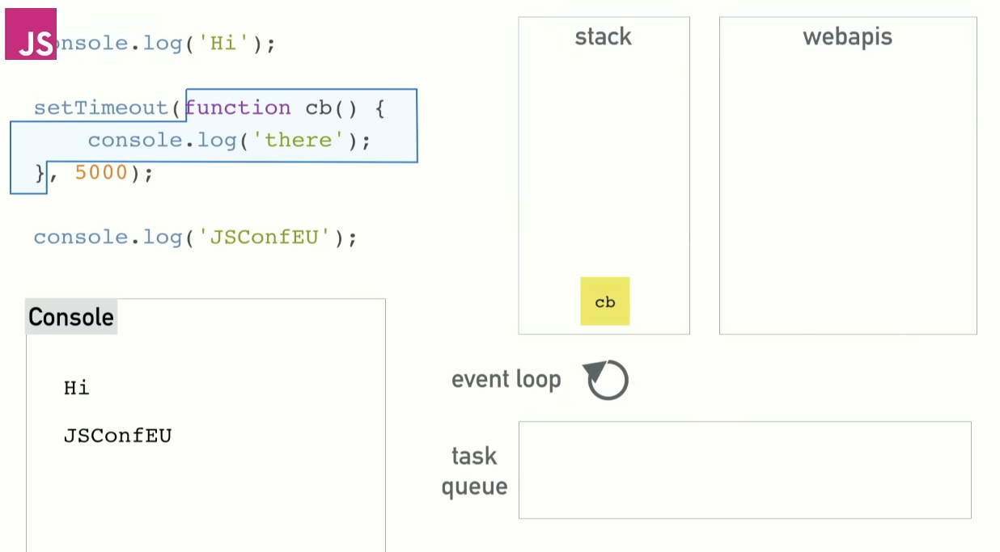
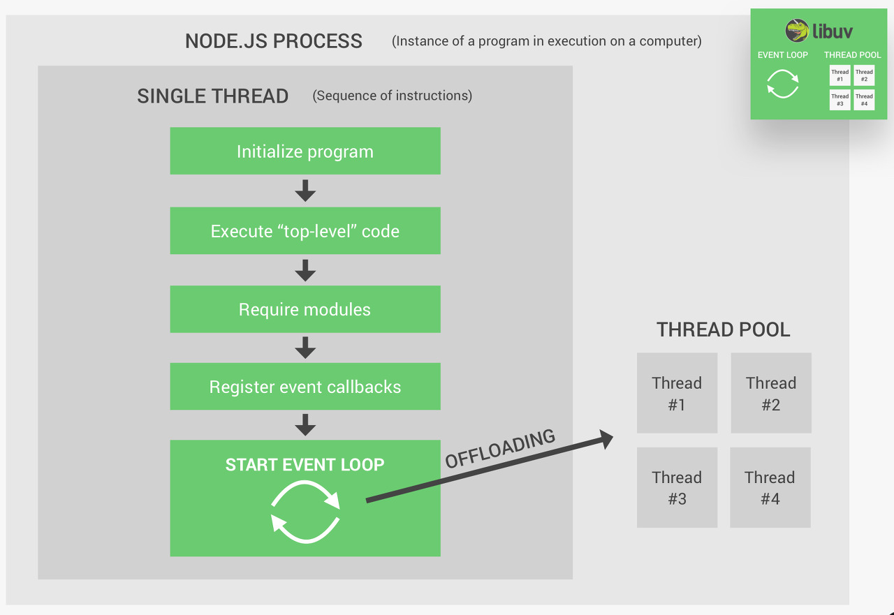
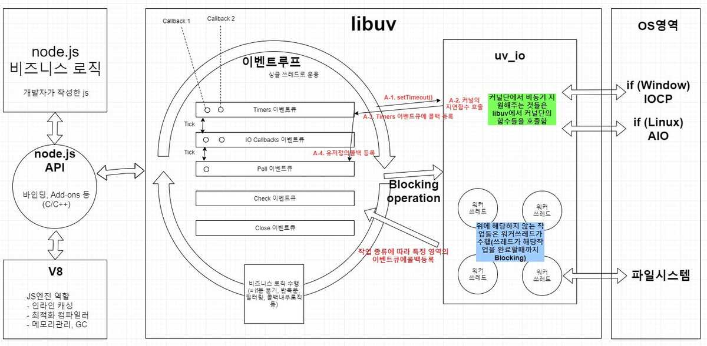

### JS 이벤트 루프

- 자바스크립트 런타임에는 메모리 할당이 일어나는 힙과 실행 정보가 담기는 콜 스택이 있다고 하죠.

- 그런데, V8 엔진을 클론해서 확인해보면 "비동기"하면 생각나는 setTimeout, OM, HTTP 요청 등에 관한 코드는 존재하지 않는다고 합니다.

- 실제로는 위 그림과 같이 브라우저의 WebAPIs와 그 유명한 EventLoop와 콜백큐를 가지고 있다고 합니다.

- 콜스택
  - 알다시피 JS는 싱글 스레드 프로그래밍 언어로, 한번에 하나의 코드만 실행할 수 있습니다. 콜스택은 함수가 실행된 순서를 기억하고 있는 스택 자료구조입니다. 호출되면 스택에 push되고, 반환되면 스택에서 pop되죠.
- Blocking
  - 느리게 실행되는 코드, 이른바 Blocking은 주로 동기적으로 실행되는 코드에서 응답을 받을 때까지 콜 스택의 동작을 멈춰 발생합니다.
- 이를 가장 쉽게 해결하는 방법이 비동기 콜백입니다.

  - 브라우저 혹은 노드에는 블로킹 함수가 거의 없이 대부분 비동기로 만들어져 있습니다.
  - 이는 어떤 코드를 실행했을 때 콜백을 받고 나중에 (함수가 반환될 때) 실행된다는 뜻입니다.
  - 그런데 정확히 그런 콜백은 어떻게 동작하는 것일까요? 상위 함수는 콜스택에서 빠져나왔는데 어떻게 콜백함수는 다시 콜스택에 들어가 실행되는 걸까요?

- 이를 위해 EventLoop와 동시성(Concurrency)가 등장합니다.

  - 자바스크립트는 한번에 하나만 실행할 수 있지만, 브라우저가 자바스크립트에서 호출할 수 있는 스레드와 같은 것들(위 그림에서 WebAPIs, NodeJS는 C++ API들을 사용합니다)을 지원하기 때문입니다.
  - 

    그림의 위에서부터 코드가 실행되면 main, console.log, setTimeout, console.log가 전부 콜스택에 push 되고 pop 됩니다.
    이때, 브라우저 WebAPIs의 타이머가 실행되고 나면 콜백 함수는 어디로 가게 될까요? 우선 taskQueue로 가게 됩니다.

    

    이벤트루프의 역할은 아주 단순한 작업 하나를 할 뿐입니다. callStack과 taskQueue를 주시하고 있습니다.
    **콜스택이 비어있다면,** 큐의 첫번째 콜백을 스택에 쌓아 실행해 줍니다.

    

    위와 같이 말이죠.
    **가끔 알수 없는 문제가 생겼을 때 setTimout(콜백, 0)을 하라는 이유가 여기 있습니다. 이전에 큐에 넣어두었던 콜백들을 먼저 실행될 수 있개 하거나 스택이 비어있을 때까지 기다리는 것이죠.**

    

    또 한가지 예시로, 위 예시 그림에서는 첫번째 동기 forEach문은 콜 스택을 차지하여 브라우저의 렌더링을 막지만, 아래의 asyncForEach는 우선순위가 높은 렌더링 큐의 작업이 먼저 콜스택에 올라가서 실행될 수 있는 틈을 주게 됩니다.
    출처: [2014 JSConf EU - 이벤트루프란 무엇인가](https://www.youtube.com/watch?v=8aGhZQkoFbQ)

### 복잡한 객체지향 구조 설계

처음부터 전부 설계할 생각하지 말고, 조금씩 구체화해가며 설계하는 것도 좋은 방법.
무조건 설계가 어렵다고 해서 구현으로 넘어가고 번갈아가며 해야지도 좋지 않다.

### 스레드 풀

Node.js 서버는 단일 스레드에서 실행되며, 서버 실행 시 top-level 코드가 먼저 실행됩니다.
필요한 모든 모듈들이 require되고 콜백 이벤트가 등록되고, 마지막으로 이벤트루프가 실행됩니다.

Node.js는 이벤트 기반으로 동작하며 대부분의 작업을 이벤트 루프가 처리하지만, 일부 작업은 이벤트루프에서 처리하기에 무겁습니다. ex: I/O작업 (파일 처리 등), 파일 압축, 비밀번호 해싱, DNS 조회, ...

이러한 무거운 작업들은 Node.js의 libuv 라이브러리를 통해 제공되는 스레드풀이 처리합니다.

기본적으로 4개의 추가 스레드 제공되며, 이벤트루프는 자동으로 무거운 작업들을 스레드풀에 할당합니다.

스레드풀 크기는 환경 변수로 조정이 가능합니다.

- 윈도우: SET UV_THREADPOOL_SIZE=1
- 맥/리눅스: UV_THREADPOOL_SIZE=1

### 종합

내용들을 종합해보면, NodeJS는 단일 콜스택을 사용한다는 점에서 싱글 스레드이며, 큐와 이벤트루프를 이용해 비동기를 처리합니다.
다만, I/O, 네트워크 등의 작업은 OS에게 넘겨주는 논블로킹 방식으로 동작하며, 그외의 특정 무거운 작업들은 또 내부적인 libuv의 스레드풀로 논블로킹을 유지합니다.

[관련 요약 블로그, reference 추가 확인해보기](https://akasai.space/node-js/about_node_js_4/)
