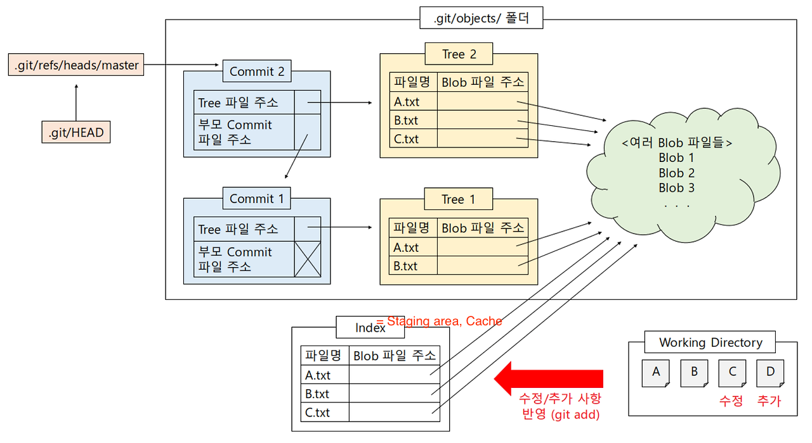

<!-- @import "[TOC]" {cmd="toc" depthFrom=1 depthTo=6 orderedList=false} -->

<!-- code_chunk_output -->

- [버전 관리 (형상 관리) 시스템](#버전-관리-형상-관리-시스템)
- [GIT 개요](#git-개요)
- [참고 도식](#참고-도식)
- [용어 정리](#용어-정리)
  - [영역](#영역)
  - [오브젝트 파일](#오브젝트-파일)
  - [명령어](#명령어)
  - [브랜치](#브랜치)
  - [NodeJS Crypto](#nodejs-crypto)
  - [NodeJS Zlib](#nodejs-zlib)

<!-- /code_chunk_output -->


## 버전 관리 (형상 관리) 시스템

- 중앙 집중식
  - 중앙 서버에서 모든 파일들을 저장 및 유지
  - 팀원들이 서로가 무슨 작업을 하는지 알 수 있습니다.
  - ex. CVS, Subversion, ...
- 분산식
  - 각 팀원 client에 Repository를 통째로 복사하여 작업합니다.
  - 중앙 서버에 문제가 생기거나, 중앙 서버와의 통신이 끊겨도 작업이 가능합니다.
  - **Git**

## GIT 개요


- 위와 같은 그림에서
  - working directory, staging area, local repository는 내 컴퓨터 (로컬 머신)
  - remote repository는 원격 서버의 구성요소 입니다.
- 아래에서는 내 컴퓨터 안의 add, commit의 동작 원리 위주로 설명합니다.

## 참고 도식


출처: [깃 내부 동작 원리 및 도식](https://it-eldorado.tistory.com/4)

## 용어 정리

### 영역

- **Working Directory(= Working Copy, Local)**
  - 위치: 프로젝트 폴더
  - 현재 프로젝트 폴더의 파일들 그 자체를 의미합니다.
- **Staging Area (= Cache, Index)**
  - 위치: 프로젝트 폴더의 .git/index
  - add의 결과로 커밋이 이뤄질 준비가 된 파일의 내용들이 위치하는 영역
  - 인덱스 파일에는 add된 변경사항 내용에 대하여 그 파일명과 해당 파일 내용을 담고 있는 Blob 파일의 주소(이름)가 기록됩니다.
- **Repository**
  - 위치: 프로젝트 폴더의 .git/objects/
  - 깃이 버전 관리를 하기 위해 필요로 하는 데이터들이 저장됩니다.
  - 대표적으로 버전 관리 시작 시점부터 현재까지 관리한 여러 버전의 파일 내용들이 Blob 파일로서 이곳에 저장됩니다.
  - 이곳에 저장된 파일들을 오브젝트 파일이라 부르며, Blob 파일도 이중 하나입니다.

### 오브젝트 파일

위의 레포지토리 영역 즉, .git/objects/ 디렉토리에 존재하는 파일을 말합니다. 아래 4개 종류가 있습니다.

- **Blob**
  - 파일의 내용이 저장됩니다.
  - **파일의 내용에 SHA1 해싱 기법을 적용해 Blob 파일 이름을 생성**하기 때문에 내용이 같은 파일이라면 하나의 Blob 파일로 저장됩니다.
    - 여러 버전에 존재하는 파일을 중복 없이 저장할 수 있습니다.
- **Tree**
  - Commit 시점의 파일들 각각에 대해 그 파일명과 해당 파일의 내용을 담고 있는 Blob 파일의 주소(이름)이 기록됩니다.
  - 위에서 말한 Staging Area 인덱스 파일 (.git/index)와 성격이 유사합니다.
- **Commit**
  - 하나의 버전 생성은 하나의 Commit 파일을 만드는 것을 의미합니다.
  - 이 파일에는 가리키고 있는 Tree 파일의 주소(이름)와 직전 버전에 해당하는 Commit 파일의 주소(이름)이 기록됩니다.
  - 히나의 Commit 파일은 하나의 Tree 파일을 가리킵니다.
- **Tag**
  - 버전 태그(ex. v0.1, v1.3)와 연관이 있습니다.
  - 여기서는 자세히 다루지 않습니다.

### 명령어

아래 명령어 앞에는 기본적을 `git`을 붙입니다.

- `init`
  - .git 폴더를 만들어 git이 버전 관리를 시작하게 합니다.
- `add <파일명>`
  - index/staging area와 비교해서 working-directory/local에서 변동된 사항을 staging area에 반영합니다.
- `status`
  - working directory와 staging area 내용을 비교해서 add의 대상이 될 파일 목록을 표시(빨간색)하고, staging area 내용과 직전 commit의 tree 파일이 가리키는 내용을 비교해 commit의 대상이 되는 파일들을 표시(초록색)합니다.
    - 색깔은 다를 수 있습니다!
    - 만약 모든 내용이 같다면 Nothing to commit을 출력합니다.

staging area(index 파일, 비록 역시 Blob 파일 생성해서 참조하지만)와 Tree(를 비롯한 오브젝트 파일들)는 특정 시점에 존재하는 파일의 정보에 대한 스냅샷에 불과하며, 각 명령어는 그러한 스냅샷을 추가하는 것에 불과하다..
추가로 이해해볼만한 예시는 아래 출처 블로그에 있습니다.

### 브랜치

- `HEAD`
  - 위치: ./git/HEAD
  - 현재 체크아웃checkout 되어 있는 브랜치의 포인터를 가리키는 포인터입니다. 위의 도식을 보면 참조 순서를 이해할 수 있습니다.
  - 간단히 말하면, 현재 브랜치를 의미합니다.
  - 브랜치의 포인터가 아닌 일반적인 Commit 파일을 가리키게 할 수도 있으며, 이를 detached HEAD라고 합니다.
- 브랜치 포인터
  - 위치: .git/refs/heads/{브랜치명}
  - 해당 브랜치의 가장 최신 Commit 파일을 가리키는 포인터입니다.
- 명령어
  - `reset <커밋>`: 브랜치 포인터가 지정된 Commit 파일을 가리키도록 바꾼다.
    - --soft: 브랜치 포인터만 바꾸고, working directory 및 staging area 유지
    - --mixed: 브랜치 포인터와 staging area를 바꾸고, working directory 유지
    - --hard: 전부 바꿉니다.
  - `checkout <브랜치명>`: HEAD(현재 브랜치)를, 지정된 브랜치의 포인터를 가리키도록 바꿉니다.
    - -b: 해당 브랜치명의 브랜치를 생성하고 checkout합니다.
  - `merge <브랜치명>` - 브랜치 내용을 가져와 현재 체크아웃되어 있는 브랜치와 병합하며 새로운 Commit 파일을 생성하고, 현재 브랜치의 포인터를 새로운 Commit 파일을 가리키게 합니다. - - 충돌이 발생할 경우 처리?
    - Fast-Forward 병합: 현재 브랜치의 Commit 파일과 대상 브랜치의 직전 Commit 파일이 완전히 같은 경우에는 Commit 파일이 새로 생성되지 않고(새로 생성되게 옵션을 줄 수는 있음) 현재 브랜치의 포인터만 옮겨주는 Fast-Forward 병합이 이루어진다.
      - 즉, 현재 브랜치의 변경 사항이 없고, 병합할 브랜치의 변경 사항만 있는 경우, 새로운 커밋을 생성하지 않고 단순히 현재 브랜치의 포인터를 병합할 브랜치의 최신 커밋으로 이동합니다.

출처: [깃 내부 동작 원리](https://it-eldorado.tistory.com/4) [관련 영상](https://www.youtube.com/watch?v=xn-kNB_a8CQ)

### NodeJS Crypto

- 파일 내용을 해시 값으로 만들려면?

```js
import crypto from "crypto";

const createHashedPassword = (password) => {
  return crypto.createHash("sha512").update(password).digest("base64");
};
```

이렇게 단순한 방식으로, 같은 알고리즘과 같은 인코딩 방식을 선택하여 암호화하면 같은 결과를 낳는다.
같은 내용의 중복 파일을 만들지 않아 버전 관리 시스템에 적합하다고 볼 수 있다.

### NodeJS Zlib

- 파일 내용을 압축해서 저장하기 위해 zlib를 써야함.

```js
const zlib = require("zlib");
const {
  NO_COMPRESSION,
  BEST_SPEED,
  BEST_COMPRESSION,
  DEFAULT_COMPRESSION
} = require("zlib");

// compress data
const deflated = zlib.deflate("hello, world", BEST_SPEED);
console.log(deflated.toString());

// decompress data
const inflated = zlib.inflate(deflated);
console.log(inflated.toString());
```
