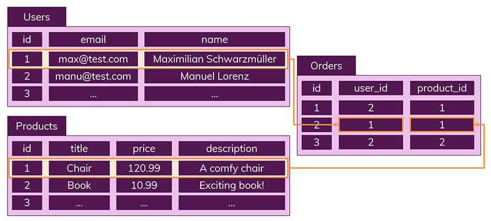
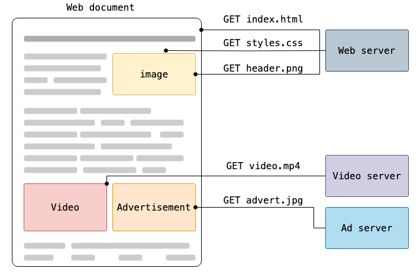
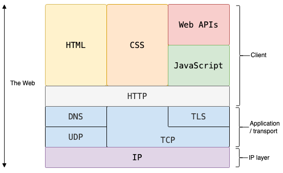
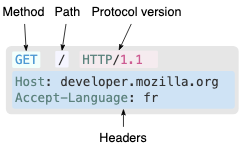
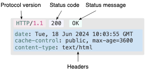

<!-- @import "[TOC]" {cmd="toc" depthFrom=1 depthTo=6 orderedList=false} -->

<!-- code_chunk_output -->

- [데이터베이스 (Database, DB)](#데이터베이스-database-db)
  - [데이터베이스란](#데이터베이스란)
  - [DBMS](#dbms)
    - [DBMS의 종류](#dbms의-종류)
    - [RDBMS와 SQL](#rdbms와-sql)
    - [이상현상 Anomaly](#이상현상-anomaly)
    - [정규화 Normalization](#정규화-normalization)
    - [조인](#조인)
    - [NoSQL](#nosql)
- [HTTP: HyperText Transfer Protocol](#http-hypertext-transfer-protocol)
  - [HTTP 구성 요소](#http-구성-요소)
  - [HTTP 메시지](#http-메시지)
    - [요청 Request](#요청-request)
    - [응답 Response](#응답-response)

<!-- /code_chunk_output -->

## 데이터베이스 (Database, DB)

### 데이터베이스란

데이터베이스를 한마디로 정의하면 "데이터의 집합"입니다.

### DBMS

위와 같은 데이터베이스를 관리하고 운영하는 소프트웨어를 DBMS(Database Management System)이라고 합니다. 직역하면 데이터베이스 관리 시스템이죠. DBMS는 정해진 방식(주로 query language)으로 데이터베이스의 데이터를 수정하거나, 다양한 사용자가 동시에 접속하고 데이터를 공유할 수 있게 도와주는 통합 시스템입니다.

#### DBMS의 종류

DBMS에는 층형(Hierarchical), 망형(Network), 관계형(Relational), 객체지향형(Object-Oriented), 객체관계형(Object-Relational) 등이 있습니다. 계층형, 망형은 현재 거의 사용되지 않습니다.

아직까지 오라클, mySQL로 대표되는 관계형(RDBMS)이 가장 많이 쓰이지만, PostgreSQL을 포함하는 객체관계형(ORDBMS)이나 MongoDB로 대표되는 NoSQL도 크게 각광받고 있습니다. [Postgre 2024 올해의 DBMS 선정](https://zdnet.co.kr/view/?no=20240104091407#:~:text=%ED%98%84%EC%9E%AC%20DB%EC%97%94%EC%A7%84%EC%9D%98%20DBMS,%EC%9C%84%EC%97%90%20%EB%A0%88%EB%94%94%EC%8A%A4%EA%B0%80%20%EC%9E%90%EB%A6%AC%ED%96%88%EB%8B%A4.)

#### RDBMS와 SQL

SQL(Structured Query Language)는 관계형 데이터베이스에서 사용되는 언어입니다. RDBMS에서는 SQL을 사용해 데이터를 저장, 수정, 삭제 및 검색할 수 있습니다.

관계형 데이터베이스에는 두 가지 핵심적인 특징이 있습니다.

- **데이터는 정해진 데이터 스키마에 따라 테이블에 저장된다.**

  - 스키마는 DB의 구조(열column에 해당하는 속성attribute, 각 속성이 모인 행이자 튜플Tuple 혹은 Entity, 속성이 취할 수 있는 값의 집합인 Domain, 표로 표현되는 개체 Entity 사이의 관계Relation 등) 와 제약 조건에 관한 명세입니다.

- **데이터는 관계를 통해 여러 테이블에 분산된다.**

스키마를 준수하지 않은 레코드는 테이블에 추가되지 않습니다. 또한, 데이터의 중복을 피하기 위해 관계Relation을 사용하며 이를 표현하는 테이블에는 중복 없이 하나의 데이터만 존재하게 됩니다. 다른 테이블에서 정확하지 않은 데이터를 다룰 위험이 사라집니다.

#### 이상현상 Anomaly

{Student ID, Course ID, Department, Course ID, Grade}와 같은 수강신청 데이터베이스를 예시로 들어 설명합니다.

- **삽입 이상 (Insertion Anomaly)**

  - 기본키가 {Student ID, Course ID} 인 경우 -> Course를 수강하지 않은 학생은 Course ID가 없는 현상이 발생함. 결국 Course ID를 Null로 할 수밖에 없는데, 기본키는 Null이 될 수 없으므로, Table에 추가될 수 없음.

  - 굳이 삽입하기 위해서는 '미수강'과 같은 Course ID를 만들어야 함.

  - 불필요한 데이터를 추가해야지만 삽입이 가능해지면? 삽입 이상

- **갱신 이상 (Update Anomaly)**

  - 만약 어떤 학생의 전공 (Department) 이 "컴퓨터"에서 "음악"으로 바뀌는 경우.

  - 모든 테이블의 해당 학생 Department를 "음악"으로 바꾸어야 함. 그러나 일부를 깜빡하고 바꾸지 못하는 경우, 제대로 파악 못함.

  - 일부만 변경하여, 데이터가 불일치 하는 모순의 문제

- **삭제 이상 (Deletion Anomaly)**

  - 만약 어떤 학생이 수강을 철회하는 경우, {Student ID, Course ID, Department, Course ID, Grade}의 정보 중

  - Student ID, Department 와 같이 그대로 필요한 학생에 대한 정보도 함께 삭제됨.

  - 튜플 삭제로 인해 꼭 필요한 데이터까지 함께 삭제되는 문제

#### 정규화 Normalization

가장 큰 목표는 테이블 간 중복된 데이터를 허용하지 않는 것이다.

- 제1정규화 (1NF)
- 제2정규화
- 제3정규화
- BCNF(Boyce and Codd Normal Form)

#### 조인

- 내부 조인
- 외부 조인
- 조인의 원리
  - 중첩 루프 조인
  - 정렬 병합 조인
  - 해시 조인

#### NoSQL

NoSQL에서는 레코드를 문서(documents)라 부릅니다. 정해진 스키마를 따라야 하는 RDBMS과는 달리 NoSQL은 다른 구조 데이터를 같은 컬렉션에 추가할 수 있습니다. 문서는 JSON과 비슷한 형태로 저장됩니다.

앞의 사진에서 Orders, Users, Products로 나눈 RDBS와 달리 NoSQL에서는 Orders에 한꺼번에 포함해 저장하게 되며, 여러 테이블에 조인할 필요 없이 이미 필요한 모든 것을 갖춘 문서를 작성하게 됩니다.

- NoSQL에서 조인을 하고 싶다면?

  - 컬렉션을 통해 데이터를 복제하여 각 컬렉션 일부분에 속하는 데이터를 정확하게 산출합니다. 다만 이때 데이터가 중복되어 서로 영향을 줄 위험이 있습니다. 따라서 조인을 잘 사용하지 않고 자주 변경되지 않는 데이터일 때 NoSQL을 쓰면 적절합니다.

- [rdbms, sql](https://gyoogle.dev/blog/computer-science/data-base/SQL%20&%20NOSQL.html)
- [스키마](https://jwprogramming.tistory.com/47)
- [RDBMS 구성](https://computer-science-student.tistory.com/194)
- [SQL vs NoSQL](https://gyoogle.dev/blog/computer-science/data-base/SQL%20&%20NOSQL.html)

## HTTP: HyperText Transfer Protocol

> _하이퍼텍스트HyperText는 컴퓨터 디스플레이 또는 기타 전자 장치에 표시되는 텍스트로, 독자가 즉시 액세스할 수 있는 다른 텍스트에 대한 참조(하이퍼링크)가 포함되어 있습니다._ - 위키피디아

HTTP는 HTML 문서와 같은 리소스를 가져오기fetch 위한 프로토콜(컴퓨터 내부 혹은 사이의 데이터 교환 방법을 정의한 규칙, 협약 체계)입니다. 웹에서 벌어지는 모든 데이터 교환의 기반이 되며, 클라이언트-서버 프로토콜이기도 합니다. 클라이언트-서버 프로토콜은 수신자(보통은 웹 브라우저) 측에 의해 요청이 시작initiate되는 프로토콜을 말합니다. 문서document 하나를 가져오기 위해 대개 text, image, layout,video, script 등 다른 하위 문서들을 불러와fetch 재구성합니다.

데이터 스트림과 달리, 클라이언트와 서버는 개별적인 메시지 교환에 의해 통신합니다. 보통 브라우저인 클라이언트에 의해 전송되는 메시지를 요청(request)라 부르며, 그에 데해 서버에서 응답으로 전송한 메시지를 응답(response)라 부릅니다.

HTTP는 애플리케이션 계층의 프로토콜로, 신뢰 가능한 전송 프로토콜이면 이론상으로 무엇이든 사용할 수 있으나 대개 TCP(혹은 암호화된 TCP인 TLS)를 통해 전송됩니다. HTTP의 우수한 확장성으로 오늘날 하이퍼텍스트 문서 뿐 아니라 이미지, 비디오, form 결과 등을 서버로 보낼(POST를 통해) 때도 사용됩니다.

### HTTP 구성 요소

HTTP는 클라이언트-서버 프로토콜로서 요청request은 사용자user-agent 또는 프록시("대리인"이라는 뜻으로, 보통 사용자와 웹사이트/서버 사이의 물리적 또는 가상 서버)하나의 개체에 의해 전송됩니다. 사용자는 주로 브라우저이지만 대개 무엇이든 될 수 있습니다. 각각의 개별적인 요청들이 서버로 보내지며, 서버는 요청request을 처리하고 응답response를 내놓습니다. 위 그림과 같이 요청과 응답 사이에는 다양한 작업을 수행하는 게이트웨이나 캐시의 역할을 하는 프록시가 존재합니다.

실제로는 브라우저와 요청을 처리하는 서버 사이에는 좀 더 많은 컴퓨터들이 존재합니다(라우터, 모뎀 등). 웹의 계층적인 설계 덕분에, 이들은 네트워크와 전송 계층(Network Latyer, Transport Layer) 내로 숨겨집니다. HTTP는 최상위인 애플리케이션 계층에 있습니다. 네트워크 문제를 진단하는 것도 중요하지만, 기본 레이어들은 HTTP의 명세와는 거의 관련이 없습니다.

### HTTP 메시지

2가지 타입의 HTTP 메시지, 요청(Request)과 응답(Response)는 각각의 형식을 가지고 있습니다.

#### 요청 Request

- **Method**: HTTP 메서드, 보통 클라이언트가 수행하고자 하는 동작을 정의한 GET, POST 같은 동사나 OPTIONS나 HEAD와 같은 명사입니다. 보통은 클라이언트는 리소스를 가져오거나(GET) HTML 폼의 데이터를 전송(POST)하려고 하지만, 다른 동작이 요구될 수도 있습니다.
- **Path**: 가져오려는 리소스의 경로; 예를 들면 프로토콜 (http://, file:///), 도메인 (여기서는 developer.mozilla.org), 또는 TCP 포트 (위에서는 HTTP 기본 포트번호 80)인 요소들을 제거한 리소스의 URL.
- **Protocol version**: HTTP 프로토콜의 버전.
- **Headers**: 서버에 대한 추가 정보, 메타 데이터를 전달하는 선택적 헤더들.
- **Body**: POST와 같은 몇 가지 메서드를 위해 전송된 리소스를 포함하는 응답Response의 본문Body과 유사한 본문.

#### 응답 Response

- **Protocol version**: HTTP 프로토콜의 버전
- **Status code**: 요청의 성공 여부와, 그 이유를 나타내는 상태 코드
- **Status message**: 상태 코드의 짧은 설명을 나타내는 상태 메시지
- **Headers**: 요청Request의 헤더와 비슷한, HTTP 헤더들
- **Body**: 선택 사항으로 가져온 리소스가 포함되는 본문

[MDN HTTP](https://developer.mozilla.org/en-US/docs/Web/HTTP/Overview)
