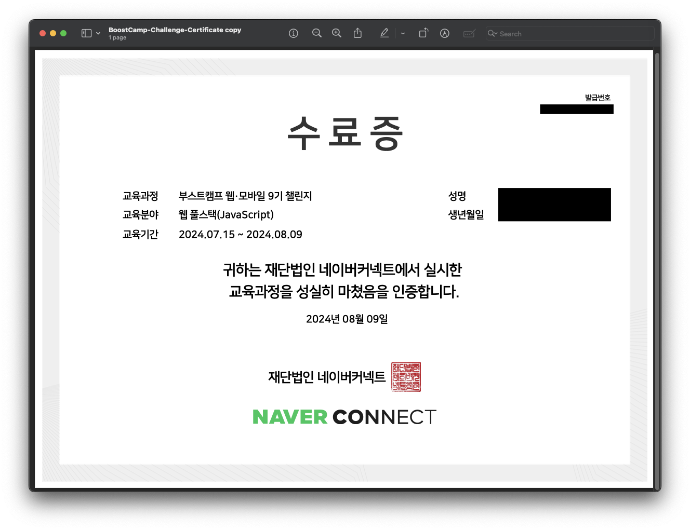
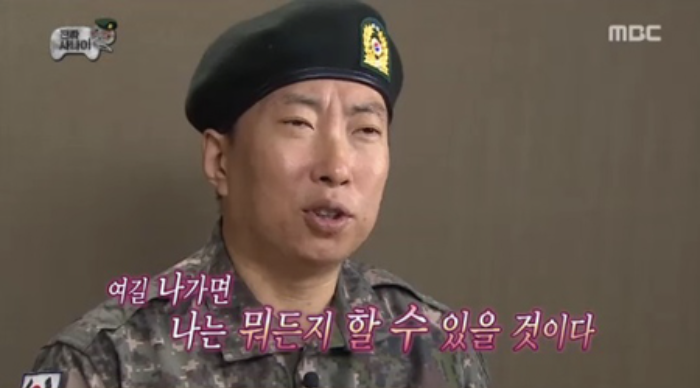
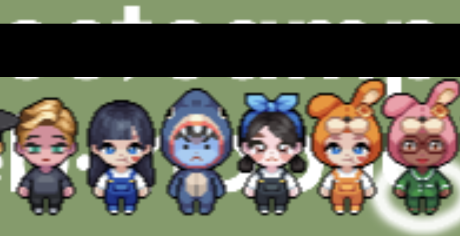

### 🏁 부스트캠프 챌린지를 수료하며

드디어 4주 간의 부스트캠프 챌린지 과정을 수료하였습니다! 사실 지난주 금요일 수료 후 며칠 지났지만, 푹 쉬고 신나게 놀면서 미루다 이제야 작성하네요 😅 자세하게 설명하기 앞서 한 마디로 챌린지 수료 소감을 정리해보자면..

"**앞으로 뭐든 해낼 수 있겠다**"는 생각이 가장 큽니다! ~~무한도전에는 없는 게 없다..~~ 누군가에게는 쉬운 과정이었을 수 있겠지만 제게는 분명 낯설고 어려웠고, 그렇기에 성취감이 있는 과정이었습니다. 이런 챌린지에 온전히 몰입하며 과정을 무사히 마치고 나니, 앞으로 무엇이 저를 기다리고 있던 어떻게든 해낼 수 있지 않을까 하는 생각이 들었습니다. 이어지는 자세한 이야기는 아래에서 추가로 말씀 드리겠습니다.

### ✨ 경험

> 제한된 시간 내 강도 높은 프로그래밍 미션 해결에 도전하며 한계를 극복합니다.
> 컴퓨터 공학의 기초 지식을 프로그래밍에 적용하고,
> 커뮤니티 안에서 동료와 함께 학습하고 방법을 연습하는 과정입니다​.

부스트캠프 공식 홈페이지에서 가져온 챌린지 설명입니다. 부스트캠프의 핵심을 전부 담고 있는 것 같습니다. 설명을 단순히 읽어보면 간단해 보이고, 만만해 보입니다. 실제 챌린지에 입과하기 전의 제가 그러했죠. 그러나 직접 마주한 과제들은 생각보다 어렵고 무엇보다 낯설었습니다. 챌린지 이전까지 아직 실무 경험이 없는 저에게, "과제"라 하면 이전까지 학습했던 내용을 활용해 요구사항을 만족하는 결과물을 만드는 것이었습니다. 조금 더 큰 규모의 "프로젝트"라면 몰라도, 이전까지 수행한 "과제"는 정도의 차이가 있을지 모르지만 대부분은 학습 기간이 정해져 있고, 과제 수행 기간 동안 정해진 요구사항을 만족하는 결과물을 내놓는 과정이었죠.

부스트캠프의 과제(미션)은 달랐습니다. 시간이 정해져 있는 것은 같지만, 모든 단계에서 스스로의 근거와 판단이 필요합니다. **요구사항을 분석하거나 숨겨진 그것을 찾아내고, 필요한 지식을 원하는 만큼 학습하고, 다양한 설계를 작성하고, 구현하고 개선한 뒤 문서화하는 과정까지, 모든 것을 능동적으로** 결정해야 했습니다. [이전 주차별 후기](https://sjy2335.github.io/posts/Challenge-Weekly-Retrospect/)에 많이 드러내지는 않았지만, 사실 초반에는 처음 경험해보는 문제 해결 절차에 당황했고 힘들었습니다. 좌절하여 "너무 불친절하다...! 내가 바보인가...? 😫"하는 생각도 했습니다. 그러나 시간이 지날수록 성장하고 있는 제 자신을 느꼈고 아래와 같은 생각들을 하며 성장하게 되었습니다.

1️⃣ 첫째, 너무 즐거운 경험이었습니다. **몰입의 즐거움**이라는 멋진 말을 스스로 실현해본지 참 오래된 것 같은데, 부스트캠프 덕분에 다시 느껴볼 수 있었습니다. 처음부터 끝까지 나만의 근거로 결정을 내리고 수행하며 문제가 척척 해결될 때, 잘 해결되지 않던 문제를 스스로 고안해낸 방법으로 해결해낼 때, 너무 어려워 끙끙 앓더라도 조금씩 문제가 해결되어 갈 때... 등등 당시는 잘 느끼지 못할 때도 있었지만 분명 너무나도 즐거운 경험이었습니다. 특히 (좀 괴짜같지만) 내가 세운 목표를 만족스럽게 이루고 머리를 식히기 위해 잠깐 쉴 때는 방안에서 혼자 막 웃기도 했었네요 😂. 처음에는 어려웠던 과정이 조금씩 쉽게 느껴지길래 단순히 익숙해졌기 때문일까 생각도 했지만 분명 나도 모르게 즐겁게 몰입하고 성장한 덕분에 그런 경험을 했던 것 같습니다.

2️⃣ 둘째, **개발자에게 필요한 기본기**는 무엇인지 생각해보고 그것을 쌓아가고 있습니다. 챌린지에서 요구사항을 나름대로 분석하고, 직접 필요한 지식을 습득하고 설계하며, 제한된 시간 안에 최선의 결과물을 내놓는 과정은 현업의 모습이 어떨지 머릿속에서 그려보는 계기가 되었습니다. 현업에서는 전공 수업처럼 친절한 학습 자료가 있지도, 명확한 가이드라인이 있지도 않겠죠. 아무리 좋은 사수가 있어도 주도적으로 학습하고 나의 시도와 생각을 정리할 수 있어야 조언을 구할 수 있을 것입니다. 이처럼, 제가 말한 개발자의 기본기는 단순히 CS 지식을 말하는 것이 아닙니다. 개발자라면 필요할 때는 빠르게 지식을 찾아서 활용할 수 있을 정도로 습득해야 하며, 주어진 시간과 자원 아래 최적의 결과물을 내놓아야 합니다. 동료들과 함께하기 위해서는 문서화 및 발표로 자신의 사고를 표현할 수도 있어야 합니다. 이러한 모든 과정에서 조그마한 결정이 있을 때마다 나만의 근거 아래 합리적인 결정이 필요하겠죠. 이것이 가능하려면 물론 CS 지식이나 프로그래밍 숙련도도 필수일 것입니다. 한마디로 정의하긴 어렵지만 개발자의 기본기는 이처럼 문제를 해결해내기 위한 총체적인 역량인 것 같습니다. 아직 실무 경험도 없어 충분한 인사이트를 갖추지 못했고, 너무 당연한 소리를 했나 싶기도 하네요. 하지만 분명한 것은 부스트캠프 덕분에 어엿한 한명의 개발자가 되기위해서 갖춰야 할 기본기는 무엇인지 능동적으로 생각해볼 수 있었습니다. 강의만 듣고, 코딩테스트 문제만 풀고, 허울 뿐인 경험만 쌓다보면 몰랐을 중요한 가치들을 얻어가는 것 같습니다.

3️⃣ 셋째, **커뮤니티와 함께 성장**하였습니다. 혼자였다면 절대 과정을 이렇게 만족스럽게 끝내지 못했겠다는 생각이 듭니다. 사실 부끄럽게도 나의 문제해결에 몰두하거나, 실명을 드러내 많은 사람들 앞에 내 의견을 드러내기 어렵다는 핑계로 슬랙에서 아주 활발히 소통하지는 못했던 것 같네요. 하지만, 매일 아침 있었던 피어 세션에서는 모두의 성장을 위해 누구보다 활발히 소통했습니다. 모든 캠퍼가 모이면 바로 마이크를 키고 녹화나 진행 방식 결정 등 사전 준비를 빠르게 마쳤습니다. 제 생각 전달에만 집중하기보다는, 모든 구성원이 동료의 문제 해결 과정을 엿보고 좋은 인사이트를 얻어갈 수 있었으면 좋겠다는 생각에, 경청과 건강한 토론을 이어가려 하였습니다. 다양한 의견 공유를 하다보면 다른 캠퍼 분들의 창의적이거나 멋진 접근법을 볼 수 있었습니다. 같은 문제에 대해서 이렇게나 결과물이 달라질 수 있다니 놀라기도 했고 매일매일 새로운 시야를 얻을 수 있었습니다. 챌린지 후반에는 조금 더 동료와 문제 해결 과정 자체에서 개별적으로 소통이 필요할 때가 있었습니다. 처음에는 혹여 내가 폐를 끼칠까, 아니면 의사 소통에 문제가 있어 진행이 더딜까 걱정도 있었습니다. 그러나 실제 해결 과정에서는 멋진 동료 분들을 만난 덕일지 진행도 원활하고, 서로의 이해를 맞추고 의사를 결정하는 과정에서 나의 생각을 표현하다보니 학습 내용이나 문제 상황에 대한 이해를 내 것으로 만들기에도 효과적이었습니다. 온전히 하나의 목표를 공유하며 소통하고 문제를 해결하니 몰입의 농도도 짙어졌고 무엇보다 즐거웠던 것 같습니다. 슬랙에서의 소통도 그렇고, 조금 더 멋진 동료가 될 수 있었을까 아쉽기도 합니다. 그럼에도 모든 커뮤니티 활동이 즐거웠고 떳떳했기에 함께 했던 동료 분들께 모두 즐거웠고 모두 성장해서 다시 만나자는 말을 드리고 싶네요..ㅎㅎ

정말 밀도 있는 경험이었고 하루 종일 문제 해결 생각만 했기에 소감을 더 말하고 싶지만, 구체적인 이야기는 할 수 없어 이만 줄여야 겠네요 😅

### 🔥 다짐

이 4주간의 몰입 경험을 앞으로 어떻게 활용할 수 있을까 생각해본 바를 말씀드리며 마치겠습니다.

조금씩 조금씩 취업이라는 현실을 마주하며 부담을 가지고 있었는데, 부스트캠프 덕에 취업에 앞서 기본기와 나만의 건강한 가치를 지닌 한 명의 개발자가 되는 것을 우선으로 삼게 됐습니다. 이곳에서 학습한 CS 지식은 당연하고, 직접 찾아낸 나만의 학습 방법, 도전적인 과제를 마주했을 때 마음가짐, 크고 작은 개발자 커뮤니티와의 소통 등 감사하게도 얻을 수 있었던 건강한 가치들을 지켜나가며 훌륭한 개발자가 되어야 겠다는 생각이 듭니다. 굳이 의식적으로 떠올리지 않아도 부스트캠프에서 만든 습관이 다양한 개발 경험에 녹아 멋진 결과들을 만들어내길 바라고 있습니다. 우선 다시 한번 나만의 큰 체크포인트로 삼을 만한 목표가 있다면 좋겠죠. 멋진 동료들과 환경의 중요성을 느꼈기에 이후 멤버십에 입과해 경험을 이어가고 싶지만, 그렇지 못한다 해도 후회는 없습니다. 아쉽기야 하겠지만...! 😂 계속해서 성장하기 위해 새로운 목표를 설정하고 나아가면 언젠가 한 명의 멋진 개발자가 될 수 있겠죠 😌 이 블로그에 나만의 학습 정리를 올리며 유지하고 개선해 나가는 작은 체크포인트부터 채워나가며 시작해야 겠습니다!

끝으로... 비록 인증샷은 4주차 팀원 분들과 밖에 못 찍었지만 모든 주차 팀원분들, 라운지에서 만났던 캠퍼 분들, 그 외에도 함께한 모든 캠퍼 분들 다들 수고 많으셨습니다 😊 멋진 분들과 함께 할 수 있어 영광이었습니다!! 이런 환경을 만들고 유지해 주신 운영진 및 이전 수료생 분들께도 감사한다는 말씀 올립니다 🙇‍♂️ 다들 계속해서 긍정적인 영향력을 펼치고 있길 바랍니다! 더욱 성장해서 멋진 모습으로 다시 만나요 👋
