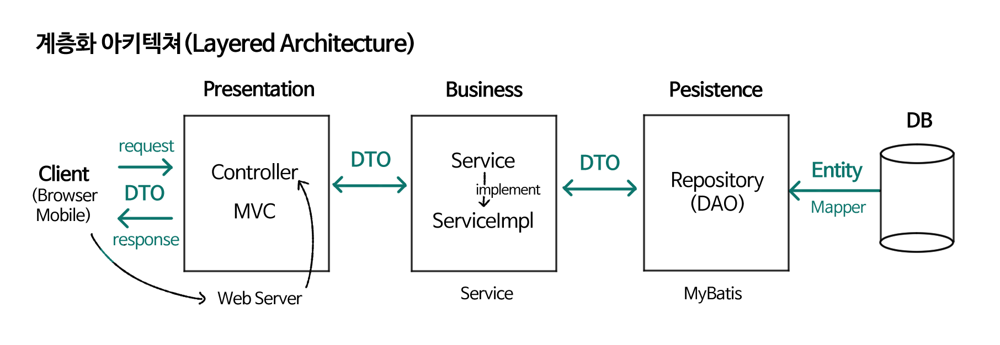
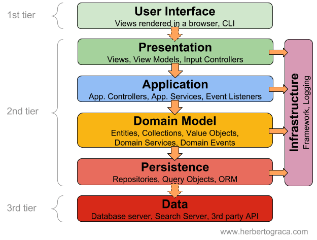

<!-- TOC -->
  * [Layered Architecture](#layered-architecture)
    * [4-Tier Layered Architecture](#4-tier-layered-architecture)
    * [Presentation Layer](#presentation-layer)
    * [Business Layer (Application Layer)](#business-layer-application-layer)
    * [Persistence Layer](#persistence-layer)
    * [Database Layer](#database-layer)
    * [정리하며](#정리하며)
<!-- TOC -->

국내에서 가장 인기 있는 백엔드 프레임워크를 뽑자면 단연 Java 진영의 Spring/SpringBoot일 것입니다. 이와 비슷한 기능을 제공하며 최근 각광받고 있는 JavaScript 진영의 NestJS도 있습니다. (사실 제가 써보고 싶어서 관심이 큽니다)  

그러나, 현재 진행 중인 프로젝트에서는 위와 같이 convention이나 규칙이 있는 프레임워크를 사용하지 않고 있습니다.

미니멀한 웹 프레임워크 ExpressJS로 서버를 구성하고, 클라이언트 단에서는 Vanilla JS를 사용하여 웹의 환경 및 다양한 기술의 원리를 학습해보고 있습니다.

다만 목표 기능을 구현하면 할 수록 구조가 복잡해지고 문제가 있을 만한 지점이 발견되었습니다. 이를 해결하기 위해서는 결국 Spring Boot나 NestJS에서 제시하는 Layered Architecture의 구조를 차용하게 되었습니다.

## Layered Architecture

Layered Architecture는 소프트웨어 개발에서 전통적으로 가장 널리 쓰이는 아키텍처 중 하나입니다. 구성되는 계층의 숫자에 따라 N 계층 아키텍처 (N-tier Architecture) 라고도 합니다.

각 계층은 애플리케이션 내에서 맡고 있는 특정한 역할 혹은 **관심사**로 구분됩니다. 이러한 Layered Architecture를 통해 관심사의 분리 (Separation of Concern)을 이룰 수 있습니다.

### 4-Tier Layered Architecture

프로그램 구현에 있어 언제나 정답은 없지만, Layered Architecture는 다음과 같은 4개의 계층으로 구분되는 경우가 많습니다.

- Presentation 계층
- Business 계층
- Persistence 계층
- DB(Database)

그림 출처: https://velog.io/@ygreenb/Layered-Architecture

많은 프로젝트에서 Controller, Service, Repository라 이름 지어진 클래스, 파일을 보신 적이 있을 겁니다. 위 그림을 확인해 보시면, 그것도 이와 같은 계층화 아키텍처를 구현한 것임을 이해할 수 있을 겁니다.

### Presentation Layer

이 계층은 사용자와 데이터를 주고받기 위해 화면에 정보를 표시하는 것을 주 관심사로 둡니다. 비즈니스 로직이 어떻게 수행되는지는 알 필요가 없습니다. 
대표적인 구성요소는 View와 Controller가 있으며, Controller를 떼어내 또다른 계층으로 볼 수도 있습니다.

view는 말 그대로 사용자 인터페이스에 불과하여 표현과 이벤트 처리, 데이터 포맷을 책임집니다.

controller는 구성 요소 간 처리 흐름을 제어하고 데이터 조작 의뢰, 데이터 변환 및 연산, 예외 처리 등의 작업을 수행합니다.

### Business Layer (Application Layer)

Business Layer, Application Layer라고도 불리며 비즈니스 로직 수행을 관심사로 둡니다. Persistence 계층에서 데이터를 가져와 비즈니스 로직을 수행하고 그 결과를 Presentation 계층(의 Controller)으로 보냅니다. Service와 Domain Model 등을 포함합니다.

여기서 비즈니스 로직(혹은 도메인 로직)이란 단순한 CRUD 작업이 아니라 요구사항을 만족하기 위해 어떻게 데이터가 저장되고 상호작용하며 수정되는지를 포함합니다.    

그림 출처: https://hudi.blog/layered-architecture/

위 그림과 같이 Service와 Domain Model을 별개의 계층으로 나누거나, 아예 Domain Model을 Layered Architecture와 별개의 것으로 분리하기도 합니다.

### Persistence Layer

영속 계층, 데이터 계층이라고도 불립니다. 데이터의 영속성을 구현하기 위해 데이터가 어떤 방식으로 보관되고 사용되는지 작성됩니다.

데이터베이스와 상호작용하여 영구 데이터를 빼내어 객체화 시키거나, CRUD 작업을 수행합니다.

대표적인 구성요소로 Repository, DAO 등이 있습니다.

### Database Layer

데이터베이스가 위치한 계층입니다. 실제 DB 서버 혹은 서드 파티 API를 가리킬 수 있습니다.

### 정리하며

구현하고, 학습하고, 마지막으로 이 글을 작성하면서 정말 많은 디자인 패턴에 관한 글을 찾아본 것 같습니다. 직접 찾아보시면 아시겠지만, 모두 명확하게 정의를 내리기 보다 함축적으로 설명하곤 합니다.

비록 아직 식견이 부족하지만, 아키텍처에 정답이란 없는 것 같습니다. 필요한 프로그램은 간단한데, 특정한 아키텍처를 따르겠다고 아무런 로직도 수행하지 않고 상위/하위 레이어에 전달만 하는 이른바 **싱크홀 안티패턴**도 있습니다.

중요한 것은 현재 나의 상황(혹은 내가 속한 조직/고객의 요구사항)에 따라 **합리적인 (기술적) 근거**를 가지고 설득력 있는 아키텍처를 구성하는 것입니다.

---
- https://velog.io/@ygreenb/Layered-Architecture
- https://hudi.blog/layered-architecture/